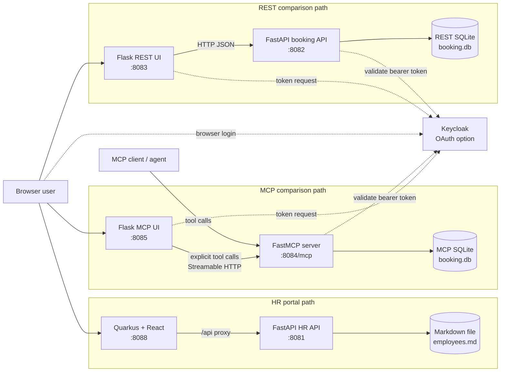

# Architecture Overview

This repository is a runnable comparison of two integration styles for one
travel-booking user journey:

- a browser application calling a REST API
- a browser application calling explicit MCP tools

It is a demonstration architecture, not a production platform. Its purpose is
to make the integration and authentication trade-offs observable without
requiring two different business examples.

## Scope And Boundaries

The two booking paths implement equivalent capabilities, but they are separate
runtimes:

| Path | User-facing application | Backend interface | Local state |
| --- | --- | --- | --- |
| REST | `galaxium-booking-web-app/` | `booking_system_rest/app.py` HTTP endpoints | its own `booking.db` SQLite database |
| MCP | `galaxium-booking-web-app-mcp/` | `booking_system_mcp/mcp_server.py` MCP tools over Streamable HTTP | its own `booking.db` SQLite database |

This means a booking made through the REST UI is not expected to appear in the
MCP UI, or vice versa. Compare the interaction pattern and auth behavior, not
shared transactional state.

`HR_database/` is a standalone supporting example service included in the full
Compose stack. The booking UIs and booking backends do not call it in the
current implementation.

## Container View

The REST and MCP applications duplicate a small booking domain deliberately:
that keeps the interface comparison visible. It is not a microservice
decomposition or an event-driven synchronization design.

## Responsibilities

| Component | Responsibility | Important constraint |
| --- | --- | --- |
| `booking_system_rest/` | FastAPI endpoints for flights, users, and bookings | HTTP contract; local SQLite state |
| `booking_system_mcp/` | MCP tools for the equivalent booking operations | `mcp_server.py` is active; `app.py` is legacy reference only |
| `galaxium-booking-web-app/` | Web journey backed by REST requests | Sends backend credentials according to mode |
| `galaxium-booking-web-app-mcp/` | Same web journey backed by MCP tool calls | Uses direct Python MCP client; no autonomous agent; Streamable HTTP only |
| `HR_database/` | Separate employee-data demonstration API | Not on either booking request path; data backed by markdown file |
| `hr_database_frontend/` | Quarkus + React HR portal; JAX-RS proxy forwards CRUD calls to `HR_database` | Java 21 / Quarkus 3; React SPA built via frontend-maven-plugin; port 8088 |
| `local-container/` | Local runtime variants, Keycloak realm, verification scripts | Source of truth for Compose behavior |
| `deployment/ibm-code-engine/` | IBM Code Engine deployment scripts | Deployment package; not live-cloud verified here |
| `testing/` | Contract, smoke, and auth-matrix automation | Source of truth for executed verification scope |

## Request Flows

### REST Booking Flow

1. The browser opens the REST Flask UI.
2. In OAuth mode, the UI authenticates the traveler through Keycloak; in
   Basic Auth mode it uses a guest browser session and configured backend
   credentials.
3. The UI calls the FastAPI booking endpoints with the applicable
   `Authorization` header.
4. The REST backend validates auth, reads or changes its SQLite state, and
   returns JSON.

### MCP Booking Flow

1. The browser opens the MCP Flask UI, or an external MCP client connects to
   `/mcp`.
2. `BookingMcpService` in the MCP UI selects a fixed tool for each UI action.
3. The direct Python MCP client calls the MCP server over Streamable HTTP and
   passes either a bearer token or a Basic Auth header.
4. The MCP tool validates auth, reads or changes its SQLite state, and returns
   structured tool output.

The MCP UI is therefore an explicit application integration example. It does
not use an LLM or dynamic tool planning in the booking path.

## Authentication Variants

| Option | Runtime label | Browser identity | REST auth | MCP auth | Use case |
| --- | --- | --- | --- | --- | --- |
| 1 | Local OAuth | Keycloak traveler login | Bearer token | Bearer token | Compare protected REST and MCP on one machine |
| 2 | VM / LAN OAuth | Keycloak traveler login via public host URL | Bearer token | Bearer token | Reach services from a VM or LAN machine while keeping token issuer URLs consistent |
| 3 | Basic Auth | Guest UI session (no Keycloak login) | Shared Basic Auth | Shared Basic Auth | Run without Keycloak; shared backend credentials |
| 4 | Mixed MCP | Keycloak traveler login (browser) | Not in this path | Shared Basic Auth | Separate browser identity from MCP backend credentials |

In the LAN OAuth option, public clients and the configured token issuer must
use the LAN-reachable Keycloak URL. Containers can still obtain JWKS over the
internal Docker network. See [local-container/README.md](./local-container/README.md)
for the runtime configuration.

## Deployment View

| Option | Runtime label | Compose files | Env file | Notes |
| --- | --- | --- | --- | --- |
| 1 | Local OAuth | `local-container/docker_compose.yaml` | none required | Full stack: both paths + Keycloak + HR API |
| 2 | VM / LAN OAuth | `docker_compose.yaml` + `docker_compose.vm-oauth.yaml` | `local-container/vm-oauth.env` | Advertises host-reachable OAuth and MCP URLs to LAN clients |
| 3 | Local Basic Auth | `local-container/docker_compose.basic-auth.yaml` | `local-container/basic-auth.env` | Both paths without Keycloak; VM/LAN variant uses `docker_compose.basic-auth-vm.yaml` |
| 4 | Mixed MCP auth | `docker_compose.yaml` + `docker_compose.mcp-ui-keycloak-basic.yaml` | `local-container/basic-auth.env` | MCP path only; Keycloak browser login + Basic Auth to MCP backend |
| — | IBM Code Engine | `deployment/ibm-code-engine/deploy-stack.sh` | `deployment/ibm-code-engine/deploy.env` | Scripted cloud deployment; Basic Auth mode by default |

For step-by-step commands for each option see [QUICKSTART.md](./QUICKSTART.md).
For the full compose file reference and verification scripts see [local-container/README.md](./local-container/README.md).

The SQLite databases and the file-backed HR data are suitable for a local
demonstration. They are not a durable multi-instance data design for
production deployment.

## Key Architecture Decisions

| Decision | Reason | Consequence |
| --- | --- | --- |
| Keep parallel REST and MCP paths | Makes protocol and client-integration differences easy to observe | Domain code and state are duplicated rather than shared |
| Use explicit MCP tool calls from the UI | Shows deterministic application-to-MCP integration | The example does not demonstrate agent planning |
| Support OAuth, Basic Auth, and one mixed path | Exposes authentication boundary choices | Runtime configuration and test combinations are broader |
| Use Compose as the primary local runtime | Provides reproducible service topology and auth dependencies | Host/LAN URL differences must be documented carefully |

## Quality Attributes And Limits

| Attribute | Current approach | Known limit |
| --- | --- | --- |
| Understandability | Small independently runnable services and two visible UI paths | Some implementation is intentionally duplicated |
| Security demonstration | Bearer validation, Basic Auth variants, negative auth tests | Demo credentials are local examples only |
| Portability | Docker Compose and an IBM Code Engine deployment package | Code Engine package has not been executed in a live IBM Cloud account in this workspace |
| Testability | REST tests, runtime smoke tests, auth matrix, deployment contracts | No production load, resilience, or observability validation |
| Data durability | Seeded SQLite for each booking backend | No cross-path consistency or durable production persistence |

## Documentation Map

| Need | Read this |
| --- | --- |
| Run the demo quickly | [QUICKSTART.md](./QUICKSTART.md) |
| Understand architecture and trade-offs | This document |
| Configure local or LAN runtime variants | [local-container/README.md](./local-container/README.md) |
| Check validation scope and commands | [testing/README.md](./testing/README.md) |
| Deploy using IBM Code Engine scripts | [deployment/ibm-code-engine/README.md](./deployment/ibm-code-engine/README.md) |
| Make a contribution | [CONTRIBUTING.md](./CONTRIBUTING.md) |

Editable diagram sources are stored in [`architecture/`](./architecture/).
`docs/reference/` contains supplemental background material and is
not required to understand or run the current system.
