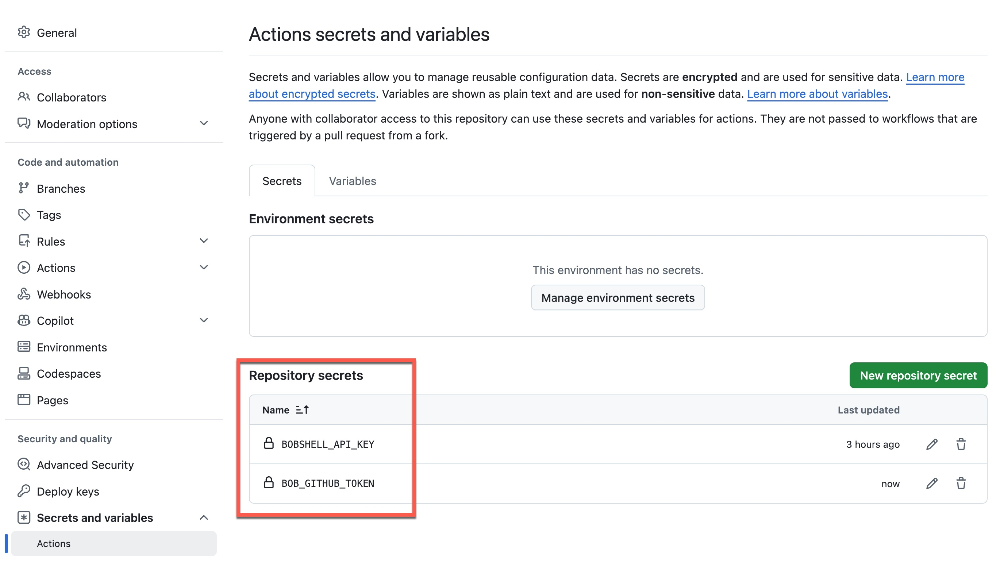

# Contributing

Thank you for improving Galaxium Travels Infrastructure.

This repository is a demonstration of REST and MCP integration patterns for an AI-ready booking app. Contributions should keep the project easy to understand, runnable, and well documented.

## Developer Certificate of Origin (DCO)

Every commit must carry a `Signed-off-by` trailer certifying agreement with the
[Developer Certificate of Origin](https://developercertificate.org/).
**The hook does this for you automatically** — run the one-time setup below
right after cloning and you never have to think about it again.

```sh
bash setup-hooks.sh
```

That script points Git at the `.githooks/` directory in this repo.
From that point on, every `git commit` appends the trailer automatically.

> **Prerequisite** — your Git identity must be configured:
> ```sh
> git config --global user.name  "Your Name"
> git config --global user.email "you@example.com"
> ```

A GitHub Actions workflow (`.github/workflows/dco.yml`) verifies the trailer on
every PR. Once GitHub's native DCO enforcement is enabled for this repository
the workflow will be removed.

## How to contribute

1. Clone the repo and run `bash setup-hooks.sh` once.
2. Open an issue for new feature ideas, bug fixes, or documentation changes.
3. Work in a feature branch with a descriptive name.
4. Keep docs in sync with code and architecture changes.
5. Submit a pull request against `main` or the current default branch.

## Local development

Use the repository quickstart first:

```sh
cd galaxium-travels-infrastructure-tsuedbro
less QUICKSTART.md
```

To run the local demo stack:

```sh
docker compose -f local-container/docker_compose.yaml up --build
```

To run only the REST path:

```sh
docker compose -f local-container/docker_compose.yaml up --build keycloak booking_system web_app
```

To run only the MCP path:

```sh
docker compose -f local-container/docker_compose.yaml up --build keycloak booking_system_mcp web_app_mcp
```

## Testing

Use the repo test guide for the authoritative scope and prerequisites:

```sh
less testing/README.md
```

Fast validation commands:

```sh
bash testing/automation/run-all-tests.sh
bash testing/automation/run-rest-api-tests.sh
bash testing/automation/run-mcp-integration-tests.sh
```

If you change docs, update both `README.md` and `QUICKSTART.md` as needed.

## Documentation updates

| Document | Responsibility |
| --- | --- |
| `README.md` | Purpose, navigation, services, and verification summary |
| `QUICKSTART.md` | Shortest runnable path and selectable runtime options |
| `ARCHITECTURE.md` | Runtime boundaries, state model, auth modes, and design consequences |
| `local-container/README.md` | Compose details, LAN configuration, and verification helpers |
| `testing/README.md` | Test scope, commands, and recorded evidence |
| `CONTRIBUTING.md` | Bob AI PR review setup, required secrets, and pull-request checklist |
| `.github/workflows/bob-pr-review.yml` | Bob PR review workflow definition |
| `.bob/custom_modes.yaml` | Project-level Bob custom mode definitions |

Keep claims precise: the REST and MCP paths expose equivalent booking flows
but use independent state stores. Do not describe them as a shared booking
database or synchronized system unless the implementation changes.

## Bob AI pull-request review

Every pull request is automatically reviewed by **Bob Shell** (IBM Bob AI CLI)
via the `.github/workflows/bob-pr-review.yml` workflow. Bob reads the changed
files, evaluates them for correctness, security, code quality, and compliance
with the project's [AGENTS.md](AGENTS.md) conventions, then posts a structured
review comment directly on the PR.

### How it works

1. The workflow installs `bobshell` on the Actions runner.
2. Bob authenticates using credentials stored as GitHub repository secrets.
3. Bob fetches the PR diff via the GitHub MCP tools, analyses every changed
   file, and posts a review comment with severity-ranked findings
   (`CRITICAL | HIGH | MEDIUM | LOW | INFO`).
4. The verdict (`APPROVE`, `REQUEST_CHANGES`, or `COMMENT`) is determined by
   the highest severity finding and is posted back to the PR automatically.

The `arch-review` mode used by the workflow is defined in
[`.bob/custom_modes.yaml`](.bob/custom_modes.yaml) so it is available on any
runner after checkout — no user-local Bob configuration is required.

### Required repository secrets

Two secrets must be configured under
**GitHub → repository → Settings → Secrets and variables → Actions**
before the workflow can run.




---

#### `BOBSHELL_API_KEY`

**What it is:** A Bob Shell API key that authenticates the CLI in non-interactive (CI) environments. It replaces the IBMid browser login flow and makes `BOB_INSTANCE_ID` / `BOB_TEAM_ID` unnecessary.

**Why it is needed:** Without it, `bob` opens a browser window to complete IBMid authentication — which is impossible inside a GitHub Actions runner.
The API key is the only Bob credential required in CI.

**Where to create it:**

1. Go to **<https://bob.ibm.com/docs/ide/account/api-keys>**
2. Click **Create API Key**
3. Set **Scope** to **Inference**
4. Copy the key immediately — it is shown only once

**How to set the secret:**

```sh
gh secret set BOBSHELL_API_KEY --body "<paste key here>"
```

Or via the GitHub UI:

1. Repository → **Settings** → **Secrets and variables** → **Actions**
2. Click **New repository secret**
3. Name: `BOBSHELL_API_KEY` · Value: paste the key · click **Add secret**

---

#### `BOB_GITHUB_TOKEN`

**What it is:** A GitHub Personal Access Token (PAT) used by Bob's GitHub MCP server to read the PR diff and post the review comment back to the PR.

**Why it is needed:** The default `GITHUB_TOKEN` available in Actions is scoped to the workflow process itself. Bob's GitHub MCP server is a separate process and needs its own token to call the GitHub REST API.

**Where to create it:**

1. Open **GitHub → Settings → Developer settings →
   Personal access tokens → Fine-grained tokens**
2. Click **Generate new token**
3. Under **Repository permissions** for this repository set:

   | Permission | Level |
   |---|---|
   | Contents | Read |
   | Pull requests | Read and write |
   | Metadata | Read (required baseline) |

4. Copy the generated token (starts with `ghp_` or `github_pat_`)

**How to set the secret:**

```sh
gh secret set BOB_GITHUB_TOKEN --body "ghp_xxxxxxxxxxxxxxxxxxxx"
```

Or via the GitHub UI:

1. Repository → **Settings** → **Secrets and variables** → **Actions**
2. Click **New repository secret**
3. Name: `BOB_GITHUB_TOKEN` · Value: paste the token · click **Add secret**

---

### Setting both secrets at once (GitHub CLI)

```sh
gh secret set BOBSHELL_API_KEY  --body "<your Bob Shell API key>"
gh secret set BOB_GITHUB_TOKEN  --body "ghp_xxxxxxxxxxxxxxxxxxxx"
```

---

## Pull Request Checklist

- Run the smallest relevant automated check from `testing/README.md`.
- Update documentation when service topology, authentication, ports, env
  variables, or commands change.
- Update `ARCHITECTURE.md` when a change affects component boundaries or a
  documented architecture decision.
- Do not commit local `.env` files, generated test output, or demo database
  files.

## Notes

This repo is a learning and demonstration project. Keep new code and documentation focused on clarity, architecture, and reproducibility.
