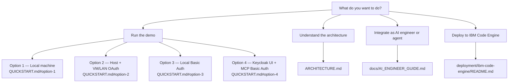

# Galaxium Travels — Navigation Hub

Use this file to find the right starting point. Pick your goal and follow one link.

## Run The Demo

| Goal | Start here |
| --- | --- |
| Everything on one laptop | [QUICKSTART.md — Option 1](./QUICKSTART.md#option-1-local-machine) |
| Stack on host, agent or VM on LAN | [QUICKSTART.md — Option 2](./QUICKSTART.md#option-2-host-machine-with-vm--lan-oauth) |
| No Keycloak, Basic Auth only | [QUICKSTART.md — Option 3](./QUICKSTART.md#option-3-local-basic-auth) |
| Keycloak browser login + MCP Basic Auth | [QUICKSTART.md — Option 4](./QUICKSTART.md#option-4-keycloak-ui--mcp-basic-auth) |
| Full compose file and script reference | [local-container/README.md](./local-container/README.md) |

## Understand The Architecture

| Goal | Start here |
| --- | --- |
| Why REST and MCP run as two separate paths | [ARCHITECTURE.md — Scope And Boundaries](./ARCHITECTURE.md#scope-and-boundaries) |
| Auth mode comparison table | [ARCHITECTURE.md — Authentication Variants](./ARCHITECTURE.md#authentication-variants) |
| Component responsibilities | [ARCHITECTURE.md — Responsibilities](./ARCHITECTURE.md#responsibilities) |
| Key architecture decisions | [ARCHITECTURE.md — Key Architecture Decisions](./ARCHITECTURE.md#key-architecture-decisions) |

## Integrate as AI Engineer or Agent

| Goal | Start here |
| --- | --- |
| MCP endpoint, tools, auth options — all in one place | [docs/AI_ENGINEER_GUIDE.md](./docs/AI_ENGINEER_GUIDE.md) |
| Step-by-step CLI walkthrough (OAuth + Basic Auth) | [docs/manual_auth_check_using_the_commandline.md](./docs/manual_auth_check_using_the_commandline.md) |
| Watson Orchestrate setup guide | [docs/reference/WATSONX_ORCHESTRATE_BOOKING_MCP_SETUP_GUIDE.md](./docs/reference/WATSONX_ORCHESTRATE_BOOKING_MCP_SETUP_GUIDE.md) |
| Watson Orchestrate Basic Auth example | [docs/watsonx_orchestrate_basic_auth_example_integration.md](./docs/watsonx_orchestrate_basic_auth_example_integration.md) |
| Machine-readable repo summary for LLM tools | [LLMS.txt](./LLMS.txt) |
| Shared agent handoff context (Bob, Claude Code, Codex) | [HANDOFF.md](./HANDOFF.md) |

## Deploy

| Goal | Start here |
| --- | --- |
| IBM Code Engine deployment scripts | [deployment/ibm-code-engine/README.md](./deployment/ibm-code-engine/README.md) |
| Code Engine + Keycloak deployment notes | [docs/reference/CODE_ENGINE_KEYCLOAK_DEPLOYMENT.md](./docs/reference/CODE_ENGINE_KEYCLOAK_DEPLOYMENT.md) |

## Test

| Goal | Start here |
| --- | --- |
| All test commands and current verified state | [testing/README.md](./testing/README.md) |
| Run everything now | `bash testing/automation/run-all-tests.sh` |
| Run REST unit tests only | `(cd booking_system_rest && python3 -m pytest tests -q)` |
| Run contract tests only | `python3 -m unittest testing.test_local_container_contracts testing.test_code_engine_deployment_contracts -v` |

## Service Quick Index

| Service | Port | Entry point | Purpose |
| --- | --- | --- | --- |
| `booking_system_rest/` | `8082` | `app.py` | FastAPI REST booking backend |
| `booking_system_mcp/` | `8084` | `mcp_server.py` | FastMCP booking server |
| `galaxium-booking-web-app/` | `8083` | `app/app.py` | Flask UI → REST backend |
| `galaxium-booking-web-app-mcp/` | `8085` | `app/app.py` | Flask UI → MCP tools |
| `HR_database/` | `8081` | `app.py` | HR data API (standalone demo) |
