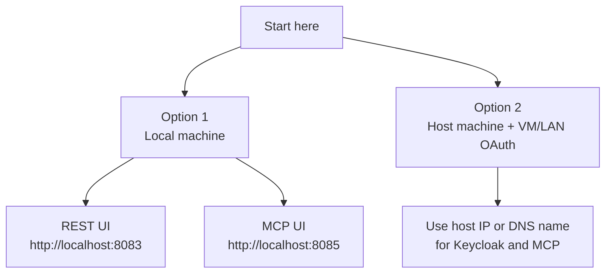

# Quickstart

This guide helps you get the example running fast.

Start in the repository root:

```sh
cd galaxium-travels-infrastructure-tsuedbro
```

## Choose Your Path



## Option 1: Local Machine

Use this option when everything runs on one machine.

### 1. Start the stack

Start the full stack:

```sh
docker compose -f local-container/docker_compose.yaml up --build
```

Start only the REST path:

```sh
docker compose -f local-container/docker_compose.yaml up --build \
  keycloak booking_system web_app
```

Start only the MCP path:

```sh
docker compose -f local-container/docker_compose.yaml up --build \
  keycloak booking_system_mcp web_app_mcp
```

### 2. Open the URLs

- Keycloak: `http://localhost:8080`
- HR API docs: `http://localhost:8081/docs`
- Booking REST API docs: `http://localhost:8082/docs`
- REST web UI: `http://localhost:8083`
- MCP endpoint: `http://localhost:8084/mcp`
- MCP web UI: `http://localhost:8085`

If you start only one path, only the matching backend and frontend URLs will be available.

### 3. Log in

- Keycloak admin: `admin` / `admin`
- Traveler user: `demo-user` / `demo-user-password`

### 4. Pick the example you want

- Use the REST example at `http://localhost:8083`
- Use the MCP example at `http://localhost:8085`

Both UIs have the same traveler flow.
The difference is the backend path:

- REST UI calls the REST API
- MCP UI calls MCP tools through the MCP server

### 5. Run the local smoke test

```sh
bash local-container/verify-keycloak-auth-e2e.sh
```

### 6. Stop the stack

```sh
docker compose -f local-container/docker_compose.yaml down
```

## Option 2: Host Machine With VM / LAN OAuth

Use this option when the Galaxium stack runs on the host machine, but another app, agent, or compose stack runs in a VM or on another machine in the LAN.

### 1. Prepare the host env file

```sh
cp local-container/vm-oauth.env.template local-container/vm-oauth.env
```

Edit `local-container/vm-oauth.env` and set the host IP or DNS name that the VM can reach:

```sh
KEYCLOAK_PUBLIC_BASE_URL=http://192.168.1.50:8080
MCP_PUBLIC_BASE_URL=http://192.168.1.50:8084
```

Do not use `localhost` in this option.

### 2. Start the host stack

Start the full host stack:

```sh
docker compose --env-file local-container/vm-oauth.env \
  -f local-container/docker_compose.yaml \
  -f local-container/docker_compose.vm-oauth.yaml \
  up --build -d
```

Start only the REST path:

```sh
docker compose --env-file local-container/vm-oauth.env \
  -f local-container/docker_compose.yaml \
  -f local-container/docker_compose.vm-oauth.yaml \
  up --build -d keycloak booking_system web_app
```

Start only the MCP path:

```sh
docker compose --env-file local-container/vm-oauth.env \
  -f local-container/docker_compose.yaml \
  -f local-container/docker_compose.vm-oauth.yaml \
  up --build -d keycloak booking_system_mcp web_app_mcp
```

### 3. Prepare the VM-side client settings

```sh
cp local-container/vm-client.env.template local-container/vm-client.env
```

Edit `local-container/vm-client.env`:

```sh
KEYCLOAK_BASE_URL=http://192.168.1.50:8080
KEYCLOAK_TOKEN_URL=http://192.168.1.50:8080/realms/galaxium/protocol/openid-connect/token
MCP_SERVER_URL=http://192.168.1.50:8084/mcp
```

### 4. Verify the LAN-facing setup

```sh
cp local-container/verify-keycloak-auth-remote.env.template local-container/verify-keycloak-auth-remote.env
bash local-container/verify-keycloak-auth-remote.sh --env-file local-container/verify-keycloak-auth-remote.env
```

### 5. Stop the host stack

```sh
docker compose --env-file local-container/vm-oauth.env \
  -f local-container/docker_compose.yaml \
  -f local-container/docker_compose.vm-oauth.yaml \
  down
```

For the detailed diagram and the explanation of why this OAuth setup works, see [local-container/README.md](./local-container/README.md).

## Run The Tests

Run the WebUI auth matrix with the local template:

```sh
cp testing/webui_matrix/local-machine-network.env.template testing/webui_matrix/local-machine-network.env
bash testing/automation/run-webui-auth-matrix.sh --env-file testing/webui_matrix/local-machine-network.env
```

Run the full cross-environment matrix:

```sh
cp testing/webui_matrix/full-matrix.env.template testing/webui_matrix/full-matrix.env
bash testing/automation/run-webui-auth-matrix.sh --env-file testing/webui_matrix/full-matrix.env
```

## Optional: MCP Inspector

If you want to inspect the MCP server manually, use:

```sh
bash local-container/start-mcp-inspector-ui.sh
```

For the full Inspector flow, use [local-container/README.md](./local-container/README.md).
