# Quickstart

Use this guide when you want a new clone running quickly.

## Fastest Path

Prerequisite: Docker Desktop or a local Docker Engine with Compose enabled.

Start from the workspace root, then move into the runnable project directory:

```sh
cd galaxium-travels-infrastructure-tsuedbro
```

All remaining commands in this file assume you are inside `galaxium-travels-infrastructure-tsuedbro/`.

1. Start the full stack:

   ```sh
   docker compose -f local-container/docker_compose.yaml up --build
   ```

   If you prefer to work inside `local-container/`, then `cd local-container && docker compose up --build` also works there.

2. Open the local services:

   - Keycloak: `http://localhost:8080`
   - HR API docs: `http://localhost:8081/docs`
   - Booking REST API docs: `http://localhost:8082/docs`
   - Web app: `http://localhost:8083`
   - MCP endpoint: `http://localhost:8084/mcp`

   Important:
   The Swagger page at `http://localhost:8082/docs` is available for inspection, but the booking REST endpoints themselves require a Keycloak bearer token in this compose setup.
   The public exception is `http://localhost:8082/health`.

3. Use the built-in demo credentials:

   - Keycloak admin: `admin` / `admin`
   - Traveler login: `demo-user` / `demo-user-password`

4. Run the end-to-end auth check:

   ```sh
   bash local-container/verify-keycloak-auth-e2e.sh
   ```

   This verifies that the REST API returns `401` without a token and works with a valid Keycloak token.

5. Stop the stack when finished:

   ```sh
   docker compose -f local-container/docker_compose.yaml down
   ```

## Access the MCP Server with MCP Inspector

Use this flow after the compose stack is running.

1. Keep the stack running in one terminal:

   ```sh
   cd galaxium-travels-infrastructure-tsuedbro
   docker compose -f local-container/docker_compose.yaml up --build
   ```

2. Ensure the MCP Inspector is not running.

   ```sh
   lsof -ti tcp:6274 -ti tcp:6277 | xargs kill -9
   ```

3. In a second terminal, start MCP Inspector:

   ```sh
   cd galaxium-travels-infrastructure-tsuedbro
   bash local-container/start-mcp-inspector-ui.sh
   ```

   The script checks the MCP OAuth metadata first and writes a helper file to `local-container/test-results/`.

4. Open the exact browser URL printed by Inspector, then verify the settings.

   Use these settings:

   - Transport: `Streamable HTTP`
   - URL: `http://localhost:8084/mcp`
   - Connection type: `Via Proxy`

   If `npx` is missing, install Node.js first.

   Important:
   In this manual flow, the Inspector OAuth screens are used first so the Inspector client gets registered in Keycloak.
   The final MCP connection in this local setup still uses `Authentication` -> `Custom Headers` with a bearer token.

5. In the browser you will see `Open Auth Settings`
   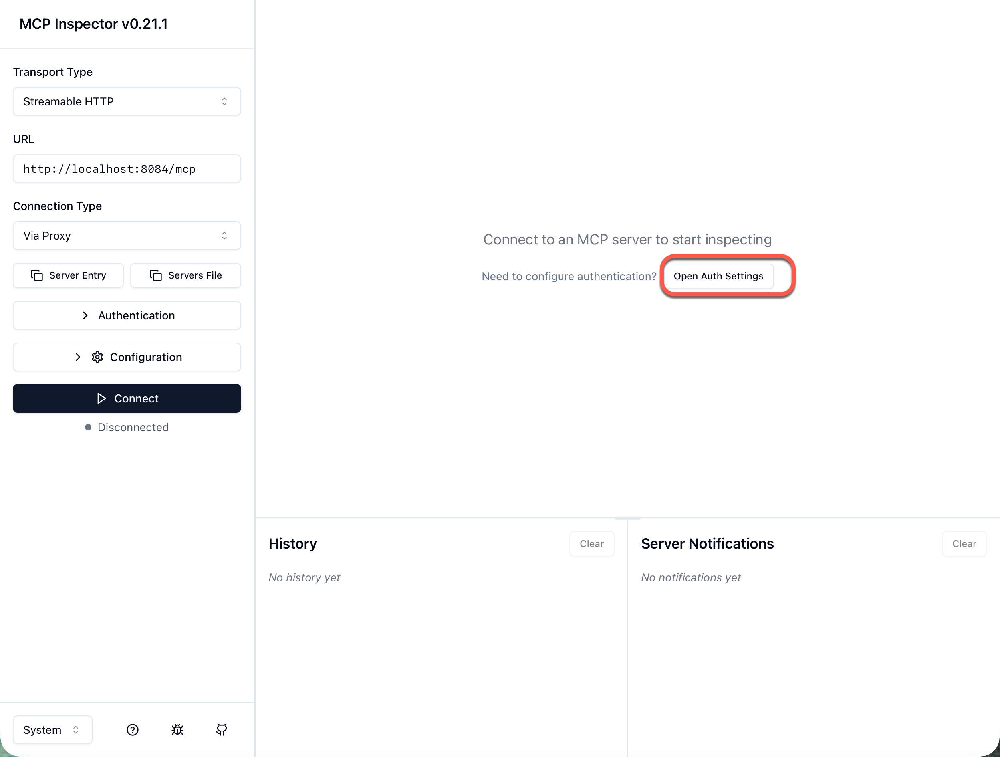

6. Follow the `Quick OAuth Flow` to register the Inspector client.
   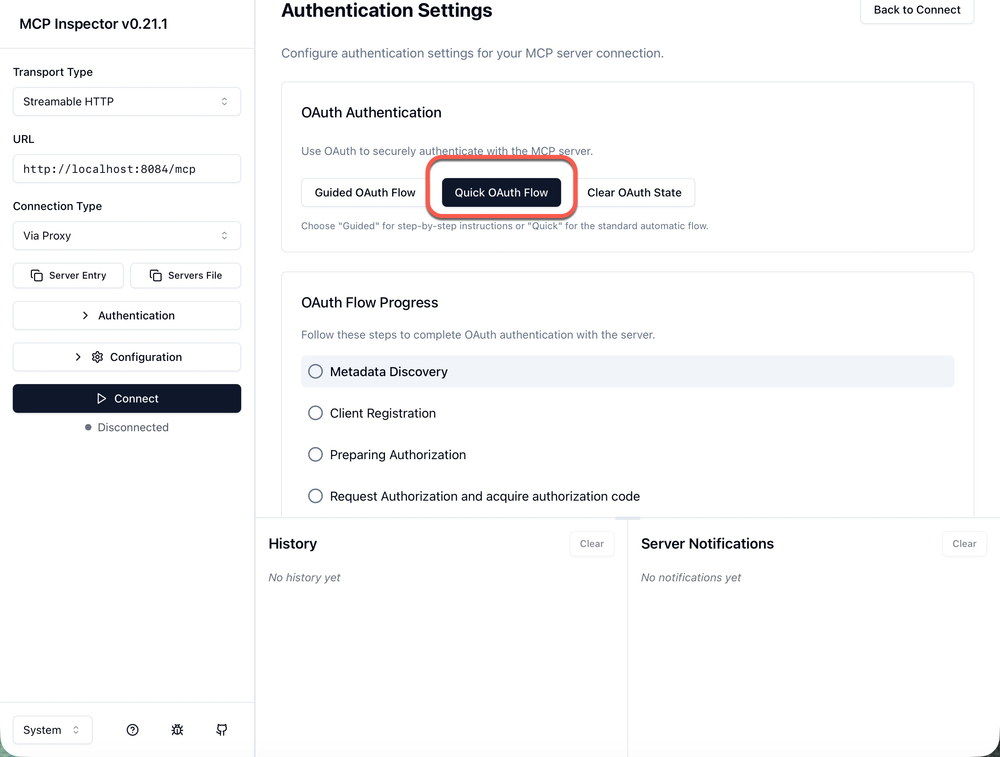

7. Press `Continue`
   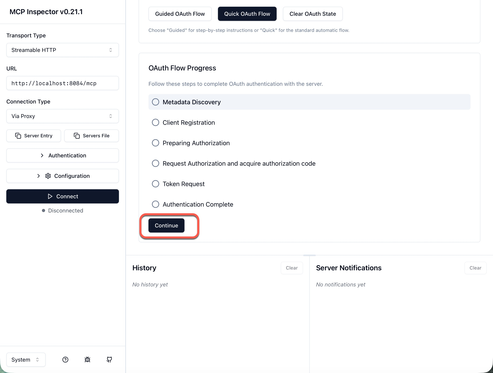

8. Verify the result for the `Metadata Discovery` step.
   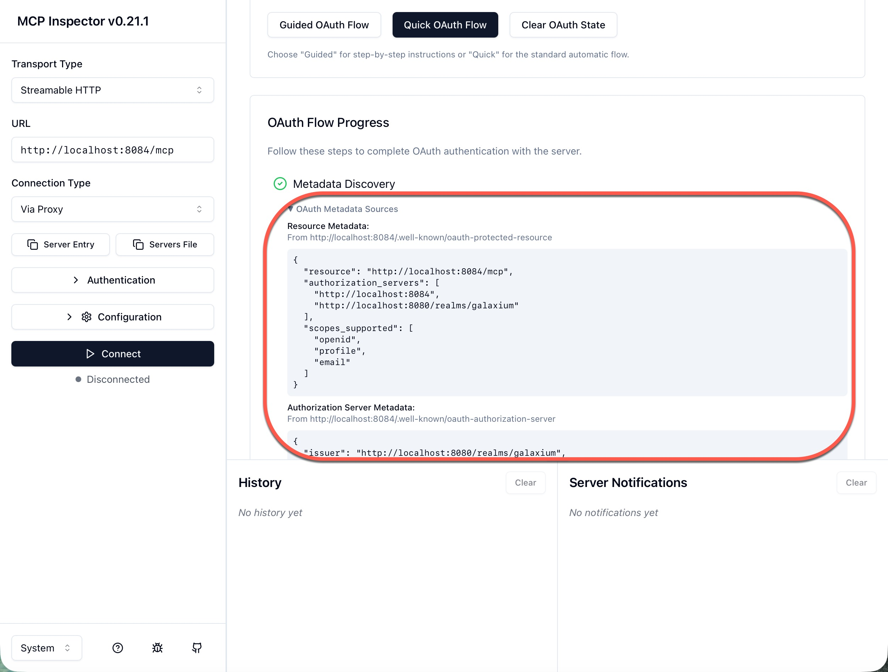

   * Example: Resource Metadata
      ```json
      {
      "resource": "http://localhost:8084/mcp",
      "authorization_servers": [
         "http://localhost:8084",
         "http://localhost:8080/realms/galaxium"
      ],
      "scopes_supported": [
         "openid",
         "profile",
         "email"
      ]
      }
      ```
    * Example: Authorization Server Metadata
      ```json
      {
         "issuer": "http://localhost:8080/realms/galaxium",
         "authorization_endpoint": "http://localhost:8080/realms/galaxium/protocol/openid-connect/auth",
         "token_endpoint": "http://localhost:8080/realms/galaxium/protocol/openid-connect/token",
         "registration_endpoint": "http://localhost:8084/oauth/register",
         "scopes_supported": [
            "openid",
            "profile",
            "email"
         ],
         "response_types_supported": [
            "code"
         ],
         "grant_types_supported": [
            "authorization_code",
            "refresh_token",
            "client_credentials",
            "password"
         ],
         "token_endpoint_auth_methods_supported": [
            "client_secret_basic",
            "client_secret_post"
         ],
         "code_challenge_methods_supported": [
            "S256"
         ],
         "jwks_uri": "http://localhost:8080/realms/galaxium/protocol/openid-connect/certs"
         }
         ```

9. Press `Continue`

10. Now the Inspector client will be registered in Keycloak and you can verify the configuration.
   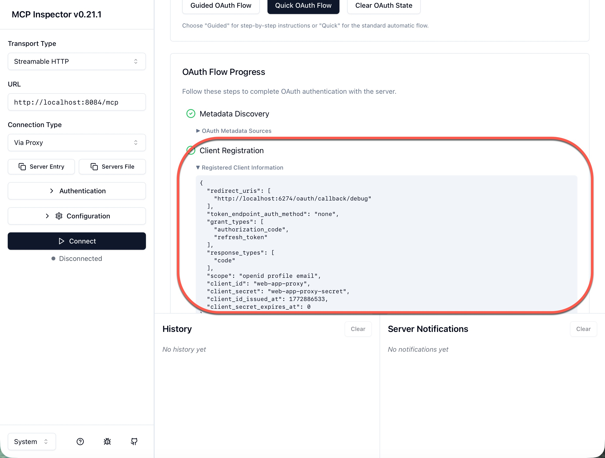

   * Example Registered Client Information:

   ```json
   {
      "redirect_uris": [
         "http://localhost:6274/oauth/callback/debug"
      ],
      "token_endpoint_auth_method": "none",
      "grant_types": [
         "authorization_code",
         "refresh_token"
      ],
      "response_types": [
         "code"
      ],
      "scope": "openid profile email",
      "client_id": "web-app-proxy",
      "client_secret": "web-app-proxy-secret",
      "client_id_issued_at": 1772886533,
      "client_secret_expires_at": 0
   }
   ```

11. Press `Continue`

12. `Preparing Authorization`

   In this step, you get a URL that you must open in a browser.
   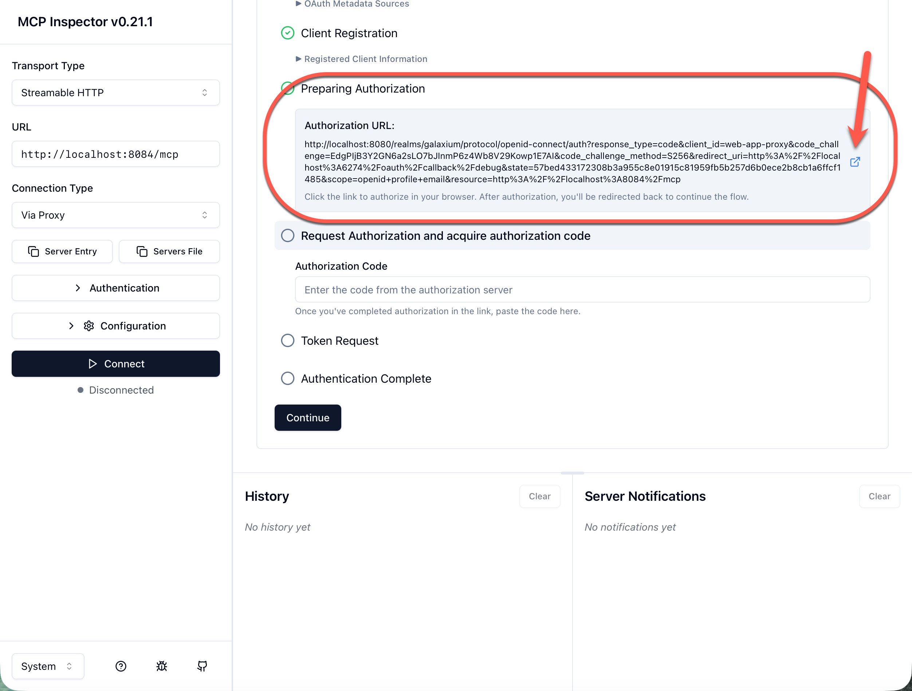

13. Copy the content from `Auth Debugger` and insert it into `Request Authorization and Acquire Authorization Code`.

   1. Log in to Keycloak: `demo-user/demo-user-password`
     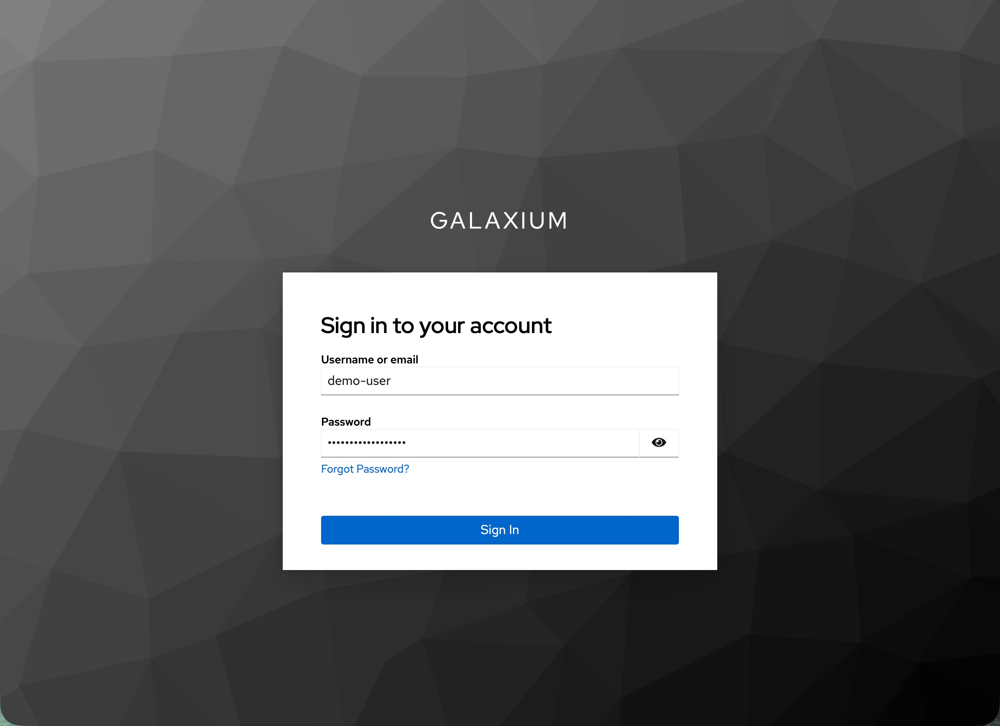


   2. Copy the content from the page.
     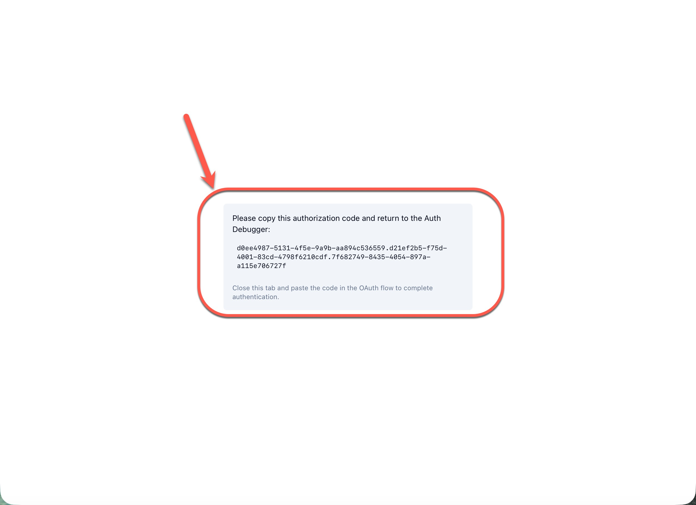

   3. Insert the content into `Request Authorization and Acquire Authorization Code`.
      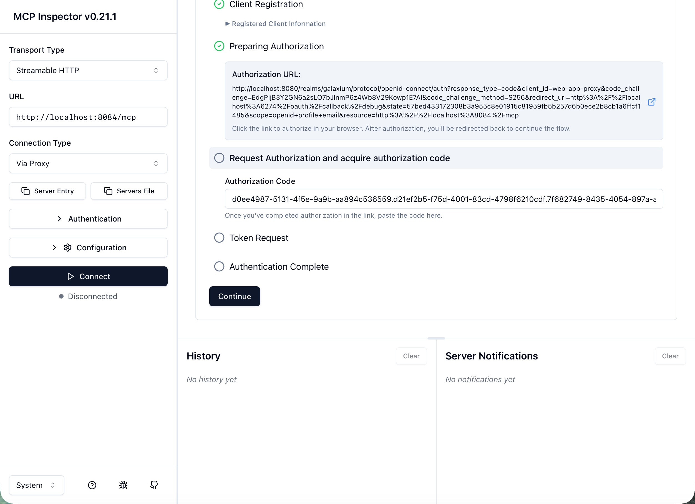

   4. Press `Continue`

   
14. Now an `Auth Token` will be requested when you press `Continue` again.
    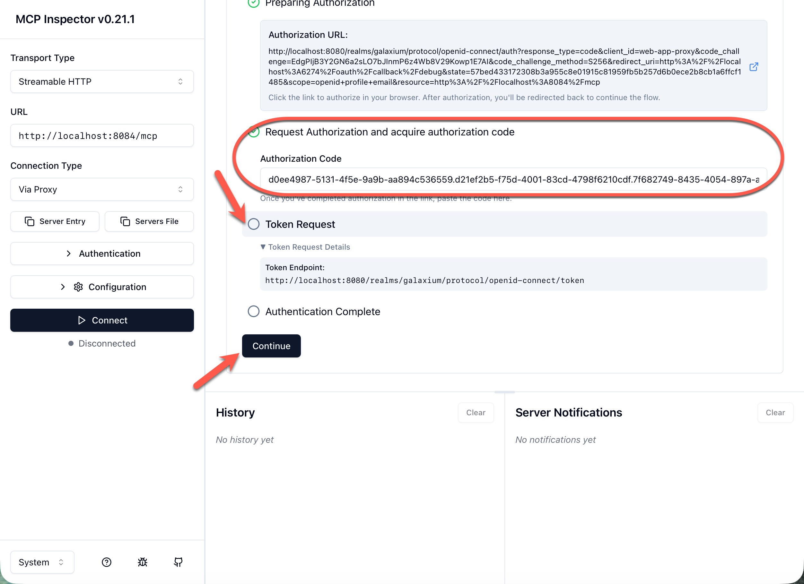

15. Now the initial auth bootstrap is complete.
    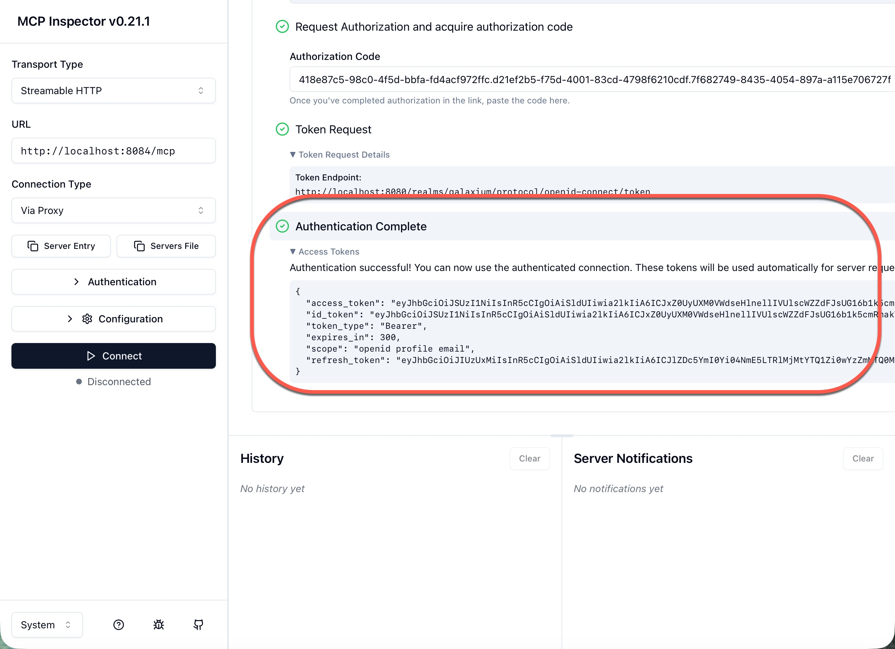

16. In a third terminal, generate the bearer token for the final `Custom Headers` connection:

   ```sh
   TOKEN="$(
     docker exec web_app python -c 'import requests; r=requests.post("http://keycloak:8080/realms/galaxium/protocol/openid-connect/token", data={"grant_type":"password","client_id":"web-app-proxy","client_secret":"web-app-proxy-secret","username":"demo-user","password":"demo-user-password"}, timeout=10); r.raise_for_status(); print(r.json().get("access_token",""))'
   )"
   TOKEN="$(echo "${TOKEN}" | tr -d '\r\n')"
   printf '{"Authorization":"Bearer %s"}\n' "${TOKEN}"
   ```

   Important:
   Use the token command above exactly as shown.
   This final MCP bearer token comes from inside the `web_app` container via `http://keycloak:8080/...`.
   Do not replace it with a token copied from the browser OAuth flow.

17. In MCP Inspector, open `Authentication`.

18. Under `Custom Headers`, enable the header row toggle, then paste the JSON from step 16 into the `JSON` editor or fill the row manually:

   - Header Name: `Authorization`
   - Header Value: `Bearer <token>`

   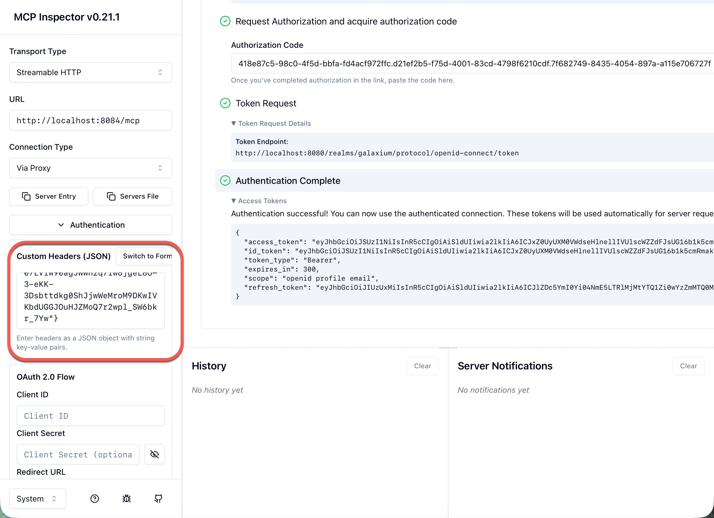

19. Press `Connect`.

20. Now you can see the MCP server content.
   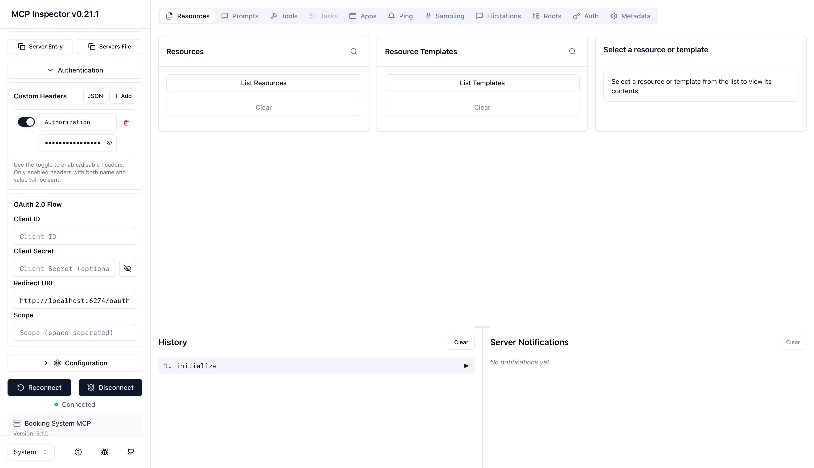
   
21. Open `Tools` and run `tools/list`.

   Expected tools:

   - `list_flights`
   - `book_flight`
   - `get_bookings`
   - `cancel_booking`
   - `register_user`
   - `get_user_id`

22. Run `tools/call` with `list_flights` to confirm end-to-end MCP access.

Optional OAuth-mode validation:

```sh
bash local-container/sync-keycloak-inspector-client.sh
bash local-container/verify-keycloak-inspector-client.sh
```

## Local Development Without Docker

Use this when you want to work on one service at a time.

### 1. Booking REST API

```sh
cd galaxium-travels-infrastructure-tsuedbro
cd booking_system_rest
python3 -m venv .venv
source .venv/bin/activate
pip install -r requirements.txt
uvicorn app:app --reload --port 8082
```

Run the tests:

```sh
python3 -m pytest tests -q
```

### 2. MCP Server

```sh
cd galaxium-travels-infrastructure-tsuedbro
cd booking_system_mcp
python3 -m venv .venv
source .venv/bin/activate
pip install -r requirements.txt
python mcp_server.py
```

Default endpoint: `http://localhost:8084/mcp`

### 3. Web App

```sh
cd galaxium-travels-infrastructure-tsuedbro
cd galaxium-booking-web-app
python3 -m venv .venv
source .venv/bin/activate
pip install -r app/requirements.txt
source .env-template
cd app
python app.py
```

Default URL: `http://localhost:8083`

The template starts the web app in the simplest local mode:

- `BACKEND_URL=http://localhost:8082/docs`
- `OAUTH2_ENABLED=false`
- `FRONTEND_AUTH_REQUIRED=false`

### 4. HR API

```sh
cd galaxium-travels-infrastructure-tsuedbro
cd HR_database
python3 -m venv .venv
source .venv/bin/activate
pip install -r requirements.txt
pip install pandas
python app.py
```

Default URL: `http://localhost:8081/docs`

## Repository Map

- `booking_system_rest/`: FastAPI booking backend with tests.
- `booking_system_mcp/`: MCP version of the booking backend. The active entry point is `mcp_server.py`.
- `galaxium-booking-web-app/`: Flask UI that talks to the REST API.
- `HR_database/`: small markdown-backed HR API.
- `local-container/`: compose setup for the full stack with Keycloak.
- `architecture/`: draw.io diagrams.
- `ai_generated_documentation/`: advanced and historical notes that are not required for local startup.
