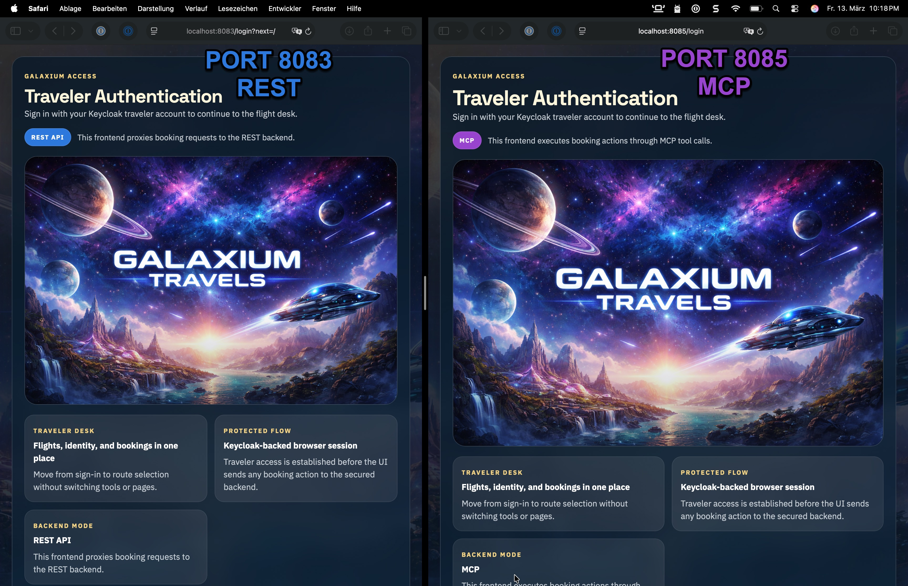
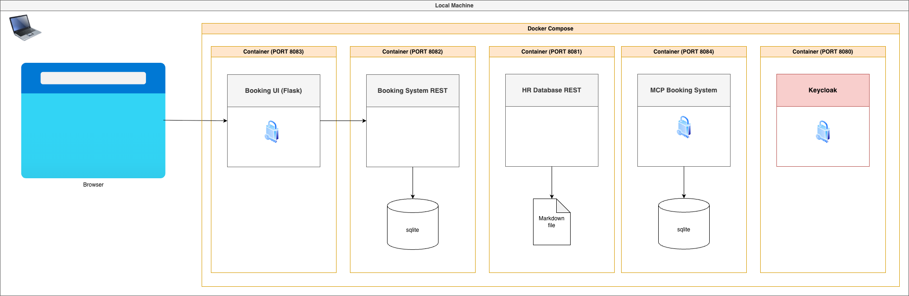

# Galaxium Travels Infrastructure

This repository is a small demo stack for the fictional company Galaxium Travels.
It combines a booking REST API, an MCP server, a Flask web UI, a markdown-backed HR API, and a local Keycloak-based compose setup.



## Start Here

- New user setup: [QUICKSTART.md](QUICKSTART.md)
- Full local stack: [local-container/README.md](local-container/README.md)
- Test automation: [testing/README.md](testing/README.md)
- Advanced deployment notes: [ai_generated_documentation/](ai_generated_documentation/)


## Services

| Path | Purpose | Default port | Canonical entry point |
| --- | --- | --- | --- |
| `booking_system_rest/` | FastAPI booking backend with SQLite | `8082` | `app.py` |
| `booking_system_mcp/` | MCP server for the same booking domain | `8084` | `mcp_server.py` |
| `galaxium-booking-web-app/` | Flask UI that talks to the REST API | `8083` | `app/app.py` |
| `HR_database/` | Small HR API backed by `data/employees.md` | `8081` | `app.py` |
| `local-container/` | Docker Compose stack with Keycloak and verification scripts | n/a | `docker_compose.yaml` |

## Recommended Validation

- REST tests:

  ```sh
  cd booking_system_rest
  python3 -m pytest tests -q
  ```

- Compose auth smoke test:

  ```sh
  cd local-container
  bash verify-keycloak-auth-e2e.sh
  ```

## Repository Layout

```text
.
├── QUICKSTART.md
├── HR_database/
├── architecture/
├── booking_system_mcp/
├── booking_system_rest/
├── galaxium-booking-web-app/
├── local-container/
└── ai_generated_documentation/
```

## Notes

- `ai_generated_documentation/` contains advanced or historical notes. It is not required for a first local run.
- `booking_system_rest/docs/` contains the detailed error-handling and testing background.
- The repository is demo-oriented and not production hardened.
