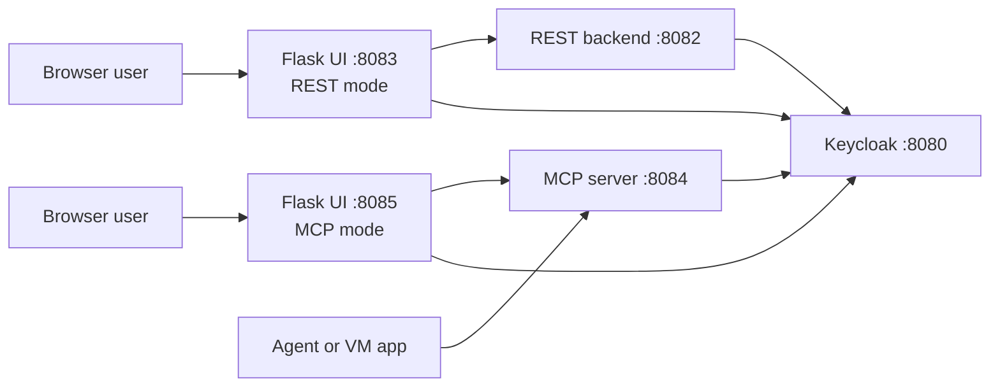

# Galaxium Travels Infrastructure

This project helps you explore one practical question:

Should an AI-ready application stay with REST, move to MCP, or support both?

In this repository you can run both styles side by side:

- a REST backend and a REST-based web UI
- an MCP backend and an MCP-based web UI
- the same Keycloak security model for both paths

This matches the idea discussed in the blog post [Should MCP replace REST for AI-ready applications?](https://suedbroecker.net/2026/03/10/should-mcp-replace-rest-for-ai-ready-applications/).
The point is not that MCP always replaces REST.
The point is that you can compare both approaches on the same business case and make a better decision.


## Why This Repo Is Useful

- You can compare REST and MCP in one small, understandable business domain.
- You can test browser users, backends, and AI-style tool access with the same security setup.
- You can run everything on one local machine.
- You can also prepare the stack for a VM or LAN setup where OAuth needs public host URLs.

## Architecture At A Glance



## Start Here

- New user path: [QUICKSTART.md](./QUICKSTART.md)
- Local compose and VM/LAN OAuth details: [local-container/README.md](./local-container/README.md)
- Test commands and current test scope: [testing/README.md](./testing/README.md)
- WebUI auth matrix details: [testing/webui_matrix/README.md](./testing/webui_matrix/README.md)
- Project quality review: [QUALITY-CHECK.md](./QUALITY-CHECK.md)
- Draft IBM Code Engine deployment: [deployment/ibm-code-engine/README.md](./deployment/ibm-code-engine/README.md)

## Main Services

| Path | Purpose | Default port | Main entry point |
| --- | --- | --- | --- |
| `booking_system_rest/` | FastAPI booking backend with SQLite | `8082` | `app.py` |
| `booking_system_mcp/` | MCP server for the same booking domain | `8084` | `mcp_server.py` |
| `galaxium-booking-web-app/` | Flask UI that calls the REST backend | `8083` | `app/app.py` |
| `galaxium-booking-web-app-mcp/` | Flask UI that calls MCP tools through a direct Python MCP client | `8085` | `app/app.py` |
| `HR_database/` | Small HR API backed by markdown data | `8081` | `app.py` |
| `local-container/` | Docker Compose setup, OAuth verifier scripts, env templates | n/a | `docker_compose.yaml` |

## Current Verified State

The current repository state was checked against the live WebUI auth matrix.

- Full matrix result: `52 tests passed`
- Skipped tests: `0`
- Verified environments:
  - `local_machine_network`
  - `local_machine_local_network_prepare`
- Verified backend modes:
  - `rest`
  - `mcp`
- Verified OAuth modes:
  - `backend_and_ui_oauth`
  - `ui_oauth`

For the exact commands, see [testing/README.md](./testing/README.md).

## Fast Validation

Run the REST API tests:

```sh
(cd booking_system_rest && python3 -m pytest tests -q)
```

Run the compose OAuth smoke test:

```sh
bash local-container/verify-keycloak-auth-e2e.sh
```

Run the WebUI auth matrix with the local template:

```sh
cp testing/webui_matrix/local-machine-network.env.template testing/webui_matrix/local-machine-network.env
bash testing/automation/run-webui-auth-matrix.sh --env-file testing/webui_matrix/local-machine-network.env
```

## Repository Layout

```text
.
├── QUICKSTART.md
├── QUALITY-CHECK.md
├── HR_database/
├── booking_system_mcp/
├── booking_system_rest/
├── galaxium-booking-web-app/
├── galaxium-booking-web-app-mcp/
├── local-container/
├── testing/
└── deployment/
```

## Notes

- This repository is a strong demo and learning project, not a finished production platform.
- The code is structured so you can grow it toward production by improving CI, observability, release handling, and shared frontend code.
- `ai_generated_documentation/` contains extra background and older notes. It is not required for a first run.
