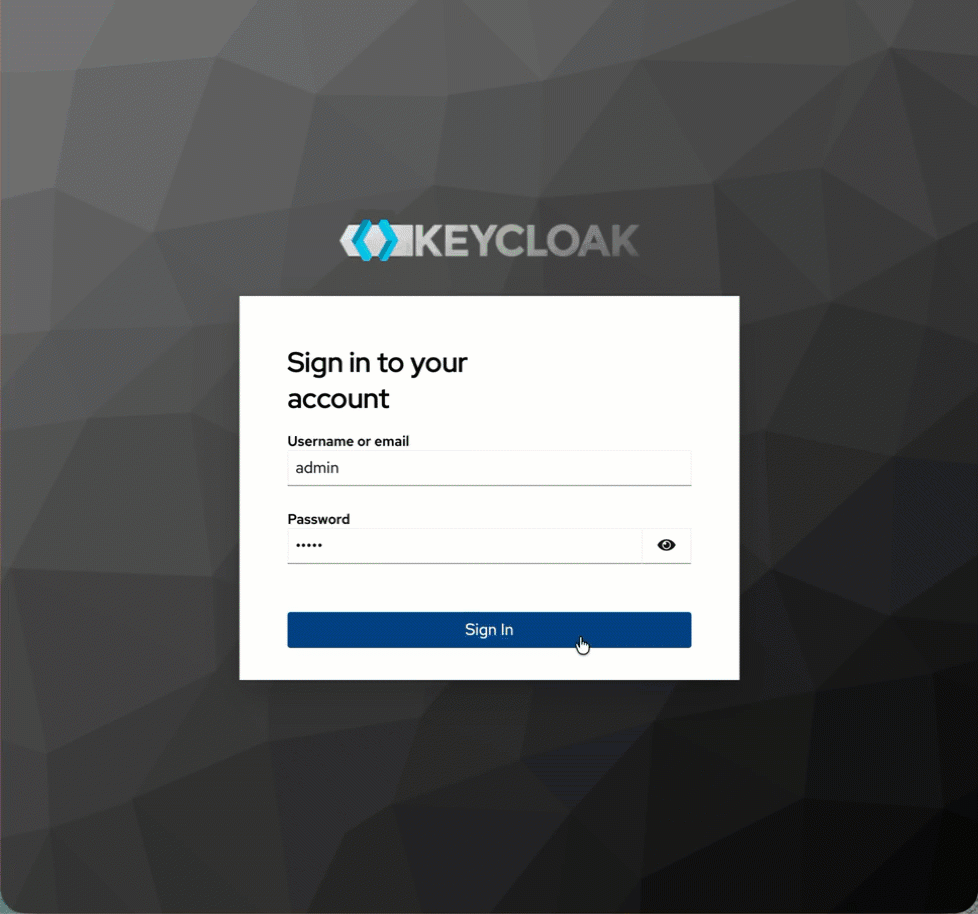

# Galaxium Travels Infrastructure

This repository contains infrastructure and demo applications for the imaginary space travel company, **Galaxium Travels**. It is designed to showcase agentic and generative AI capabilities in a modular, easy-to-deploy way.

The initial repository was https://github.com/Max-Jesch/galaxium-travels. The changes here will not contributed back to the initial repository.

## Recent Improvements 🆕

### Enhanced Error Messages for AI Agents
We've significantly improved error messages across all systems to make them more actionable for AI agents:

- **Clear Problem Identification**: Error messages now explain exactly what went wrong
- **Actionable Next Steps**: Specific suggestions for resolution are provided
- **Alternative Approaches**: Other endpoints or tools are suggested when applicable
- **AI-Friendly Format**: Messages are structured to help AI agents make decisions

**Examples:**
- **Before**: `"User not found"`
- **After**: `"User with ID 999 is not registered. Please register first using /register endpoint"`

See the [Error Handling Guide](docs/error-handling-guide.md) for detailed examples and the [Error Handling Examples](docs/error-handling-examples.md) for before/after comparisons.

### Keycloak-Enforced Traveler Authentication (Containerized Flow)
The containerized setup now enforces an end-to-end authenticated booking flow with Keycloak:

- The web app redirects unauthenticated users from `/` to `/login`.
- Travelers authenticate in the frontend against Keycloak before booking actions are available.
- Traveler identity is derived from the Keycloak token and synced to the booking backend.
- Booking backend endpoints are protected and return `401` without a bearer token.

Compose defaults now set:

- `AUTH_ENABLED=true` on `booking_system_rest`
- `OAUTH2_ENABLED=true` on `galaxium-booking-web-app`
- `FRONTEND_AUTH_REQUIRED=true` on `galaxium-booking-web-app`

Containerized verification:

```sh
cd local-container
bash verify-keycloak-auth.sh
```

For non-compose deployments (for example IBM Cloud Code Engine), use:

```sh
bash local-container/verify-keycloak-auth-remote.sh
```

* Example to login to Keycloak



* Example using authentication on galaxium travels


## Repository Structure

```
galaxium-travels-infrastructure/
  booking_system_rest/     # FastAPI + SQLite REST API booking system
  booking_system_mcp/      # MCP (Model Context Protocol) server version
  galaxium-booking-web-app/ # Flask web app for traveler booking flow
  HR_database/             # HR database app with markdown backend
  local-container/         # Docker Compose stack + Keycloak auth verification scripts
  ai_generated_documentation/ # Deployment guides (including Code Engine + Keycloak)
  docs/                    # Documentation and guides
  README.md                # This file
```

## Applications

### 1. Booking System (REST API)
- **Path:** `booking_system_rest/`
- **Description:** A mock space travel booking system built with FastAPI and SQLite. Demonstrates core booking flows and is ready for agentic integration.
- **Features:**
  - List available flights
  - Book a flight
  - View user bookings
  - Cancel a booking
  - Auto-seeded demo data on startup
- **See:** [`booking_system_rest/README.md`](booking_system_rest/README.md) for setup, usage, and deployment instructions.

### 2. Booking System (MCP Server)
- **Path:** `booking_system_mcp/`
- **Description:** Model Context Protocol (MCP) server version of the booking system, designed for direct AI agent integration.
- **Features:**
  - Same functionality as REST API but via MCP tools
  - Optimized for AI agent workflows
  - Enhanced error messages for better agent understanding

### 3. Booking Web Application
- **Path:** `galaxium-booking-web-app/`
- **Description:** Flask-based traveler-facing web app that proxies to `booking_system_rest`.
- **Security behavior:**
  - Supports OAuth2/OIDC integration with Keycloak
  - Enforces traveler login in browser when `FRONTEND_AUTH_REQUIRED=true`
  - Uses authenticated traveler token for booking backend requests
- **See:** [`galaxium-booking-web-app/README.md`](galaxium-booking-web-app/README.md) for runtime variables and auth flow details.

### 4. HR Database
- **Path:** `HR_database/`
- **Description:** HR database application with markdown backend for employee management.
- **Features:**
  - Employee CRUD operations
  - Markdown-based data storage
  - Enhanced error handling for AI agents

## Documentation

- **[Error Handling Guide](docs/error-handling-guide.md)**: Comprehensive overview of error message improvements
- **[Error Handling Examples](docs/error-handling-examples.md)**: Before/after examples with AI agent actions
- **[Testing Guide](docs/testing-guide.md)**: How to test the improved error handling
- **[Local container guide](local-container/README.md)**: Includes OAuth2/OIDC Keycloak auto-setup and manual fallback configuration steps
- **[Code Engine + Keycloak guide](ai_generated_documentation/CODE_ENGINE_KEYCLOAK_DEPLOYMENT.md)**: Non-compose deployment steps for the same authenticated setup
- **[Web app auth guide](galaxium-booking-web-app/README.md)**: Traveler login flow, required env vars, and runtime auth modes

## Prerequisites
- Python 3.9+
- [pip](https://pip.pypa.io/en/stable/)
- (Optional) [Fly.io CLI](https://fly.io/docs/hands-on/install-flyctl/) for cloud deployment

## Local Development
Each app is self-contained. To run an app locally:
1. `cd` into the app directory (e.g., `cd booking_system_rest`)
2. Follow the instructions in that app's `README.md`

## Deployment
- Each app can be deployed independently to Fly.io or another platform.
- See the per-app `README.md` for deployment steps and configuration.

## Contributing
Feel free to fork, open issues, or submit pull requests for improvements or new demo apps!

---

**This repository is for demonstration and prototyping purposes only.** 
