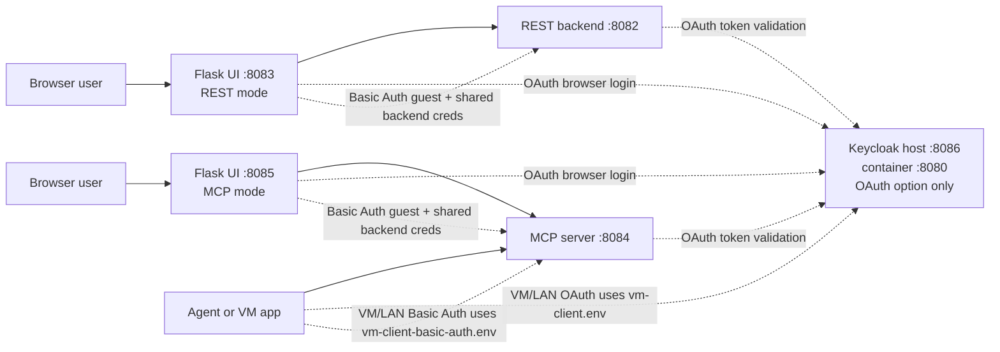

# Galaxium Travels Infrastructure

This project helps you explore one practical question:

Should an AI-ready application stay with REST, move to MCP, or support both?

In this repository you can run both styles side by side:

- a REST backend and a REST-based web UI
- an MCP backend and an MCP-based web UI
- the same Keycloak OAuth path for both styles
- an additional Basic Auth variant for the REST backend, MCP server, REST UI, and MCP UI

This matches the idea discussed in the blog post [Should MCP replace REST for AI-ready applications?](https://suedbroecker.net/2026/03/10/should-mcp-replace-rest-for-ai-ready-applications/).
The point is not that MCP always replaces REST.
The point is that you can compare both approaches on the same business case and make a better decision.

Editable source diagram: [architecture/galaxim-travel-infrastructure.drawio](./architecture/galaxim-travel-infrastructure.drawio)


## Why This Repo Is Useful

- You can compare REST and MCP in one small, understandable business domain.
- You can test browser users, backends, and AI-style tool access with both Keycloak OAuth and shared Basic Auth.
- You can run everything on one local machine.
- You can also prepare the stack for a VM or LAN setup where OAuth needs public host URLs.
- You can choose the matching env template for each option: `local-container/vm-client.env.template`, `local-container/basic-auth.env.template`, or `local-container/vm-client-basic-auth.env.template`.

## Architecture At A Glance


```mermaid
flowchart LR
    Browser1["Browser user"] --> UIREST["Flask UI :8083<br/>REST mode"]
    Browser2["Browser user"] --> UIMCP["Flask UI :8085<br/>MCP mode"]
    Agent["Agent or VM app"] --> MCP["MCP server :8084"]
    UIREST --> REST["REST backend :8082"]
    UIMCP --> MCP
    UIREST -. "OAuth browser login" .-> KC["Keycloak host :8086<br/>container :8080<br/>OAuth option only"]
    UIMCP -. "OAuth browser login" .-> KC
    REST -. "OAuth token validation" .-> KC
    MCP -. "OAuth token validation" .-> KC
    UIREST -. "Basic Auth guest + shared backend creds" .-> REST
    UIMCP -. "Basic Auth guest + shared backend creds" .-> MCP
    Agent -. "VM/LAN OAuth uses vm-client.env" .-> KC
    Agent -. "VM/LAN Basic Auth uses vm-client-basic-auth.env" .-> MCP
```

## Start Here

- New user path: [QUICKSTART.md](./QUICKSTART.md)
- Local compose, VM/LAN OAuth, and Basic Auth details: [local-container/README.md](./local-container/README.md)
- Test commands and current test scope: [testing/README.md](./testing/README.md)
- WebUI auth matrix details: [testing/webui_matrix/README.md](./testing/webui_matrix/README.md)
- Project quality review: [QUALITY-CHECK.md](./QUALITY-CHECK.md)
- Draft IBM Code Engine deployment: [deployment/ibm-code-engine/README.md](./deployment/ibm-code-engine/README.md)

## Main Services

| Path | Purpose | Default port | Main entry point |
| --- | --- | --- | --- |
| `booking_system_rest/` | FastAPI booking backend with SQLite | `8082` | `app.py` |
| `booking_system_mcp/` | MCP server for the same booking domain | `8084` | `mcp_server.py` |
| `galaxium-booking-web-app/` | Flask UI that calls the REST backend | `8083` | `app/app.py` |
| `galaxium-booking-web-app-mcp/` | Flask UI that calls MCP tools through a direct Python MCP client | `8085` | `app/app.py` |
| `HR_database/` | Small HR API backed by markdown data | `8081` | `app.py` |
| `local-container/` | Docker Compose setup, OAuth and Basic Auth verifier scripts, env templates | n/a | `docker_compose.yaml` |

## Current Verified State

Current change-set status as of `2026-03-23`:

- Aggregate repo test runner passed on `2026-03-23`.
- Local-container contract checks passed on `2026-03-23` with `9/9` tests green.
- REST API pytest suite passed on `2026-03-23` with `37` tests green and no pytest warning summary.
- Local OAuth smoke rerun passed on `2026-03-23`.
- Local Basic Auth backend smoke rerun passed on `2026-03-23`.
- Local Basic Auth frontend plus MCP Inspector smoke rerun passed on `2026-03-23`.
- VM / LAN remote auth verification rerun passed on `2026-03-23` against `192.168.178.154`.

The latest full eight-variant WebUI auth matrix rerun is still the `2026-03-18` run:

- Result: `55 tests passed`, `0 skipped`
- Environments: `local_machine_network`, `local_machine_local_network_prepare`
- Backend modes: `rest`, `mcp`
- OAuth modes: `backend_and_ui_oauth`, `ui_oauth`

For the exact commands and current scope split, see [testing/README.md](./testing/README.md).

## Test Status Overview

Status meaning:

- `🟢`: executed and passed for the current change set
- `🟡`: not rerun for the current change set
- `🔴`: executed and failed for the current change set

| Status | Scope | Result |
| --- | --- | --- |
| `🟢` | Aggregate repo regression slice | `bash testing/automation/run-all-tests.sh` passed on `2026-03-23`, including local-container contracts, REST pytest, UI OAuth smoke, and MCP OAuth smoke |
| `🟢` | Local-container contract checks | `bash testing/automation/run-local-container-contract-tests.sh` passed on `2026-03-23` with `9/9` tests green |
| `🟢` | REST API pytest suite | `bash testing/automation/run-rest-api-tests.sh` passed on `2026-03-23` with `37` tests green and no pytest warning summary |
| `🟢` | Local compose OAuth smoke test | `bash local-container/verify-keycloak-auth-e2e.sh` passed end to end on `2026-03-23`, including REST auth, MCP auth, traveler web login, Inspector client sync, and OAuth metadata discovery. Report: `local-container/test-results/oauth-e2e-all-20260323T172444Z.md` |
| `🟢` | Local Basic Auth backend smoke test | `bash local-container/verify-basic-auth-backends.sh` passed on `2026-03-23`, including REST `401/200` checks plus authenticated MCP `initialize`, `tools/list`, and `tools/call(list_flights)` |
| `🟢` | Local Basic Auth frontend + MCP Inspector smoke test | `bash local-container/verify-basic-auth-frontends-and-inspector.sh` passed on `2026-03-23`, including REST UI guest flow, MCP UI guest flow, and Basic Auth Inspector config generation with `Streamable HTTP` |
| `🟢` | WebUI matrix unit config checks | `python3 -m unittest testing.webui_matrix.tests.unit.test_config -v` passed on `2026-03-18` with `11/11` tests green |
| `🟢` | Full WebUI auth matrix | Rerun passed on `2026-03-18`: `55` tests ran, `55` passed, `0` skipped |
| `🟢` | VM / LAN remote auth verification | Rerun passed on `2026-03-23` against `192.168.178.154`, including the repo remote verifier, MCP OAuth metadata checks, and authenticated `mcp_test_app.py` over `Streamable HTTP` |
| `🟢` | Current failing checks in this change set | None from the executed checks |

## Fast Validation

Run the REST API tests:

```sh
(cd booking_system_rest && python3 -m pytest tests -q)
```

Run the local-container contract tests:

```sh
bash testing/automation/run-local-container-contract-tests.sh
```

Run the compose OAuth smoke test:

```sh
bash local-container/verify-keycloak-auth-e2e.sh
```

Run the local Basic Auth backend smoke test:

```sh
bash local-container/verify-basic-auth-backends.sh
```

Run the local Basic Auth frontend plus Inspector smoke test:

```sh
bash local-container/verify-basic-auth-frontends-and-inspector.sh
```

Run the current aggregate repo regression slice:

```sh
bash testing/automation/run-all-tests.sh
```

Run the WebUI auth matrix with the local template:

```sh
cp testing/webui_matrix/local-machine-network.env.template testing/webui_matrix/local-machine-network.env
bash testing/automation/run-webui-auth-matrix.sh --env-file testing/webui_matrix/local-machine-network.env
```

## Repository Layout

```text
.
├── QUICKSTART.md
├── QUALITY-CHECK.md
├── HR_database/
├── booking_system_mcp/
├── booking_system_rest/
├── galaxium-booking-web-app/
├── galaxium-booking-web-app-mcp/
├── local-container/
├── testing/
└── deployment/
```

## Notes

- This repository is a strong demo and learning project, not a finished production platform.
- The code is structured so you can grow it toward production by improving CI, observability, release handling, and shared frontend code.
- `ai_generated_documentation/` contains extra background and older notes. It is not required for a first run.
