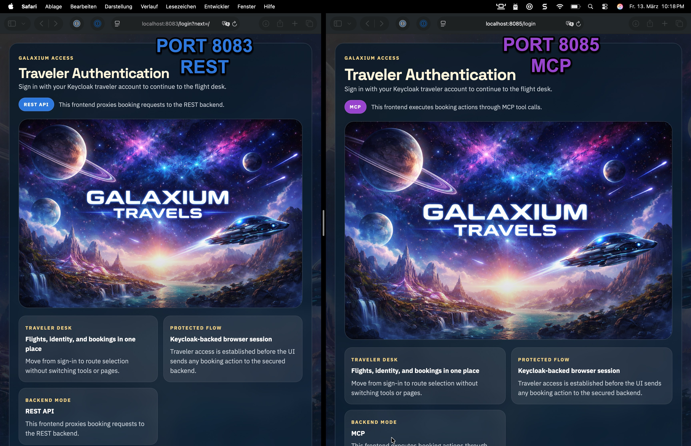
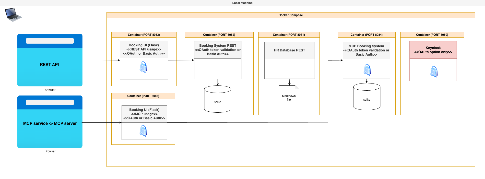
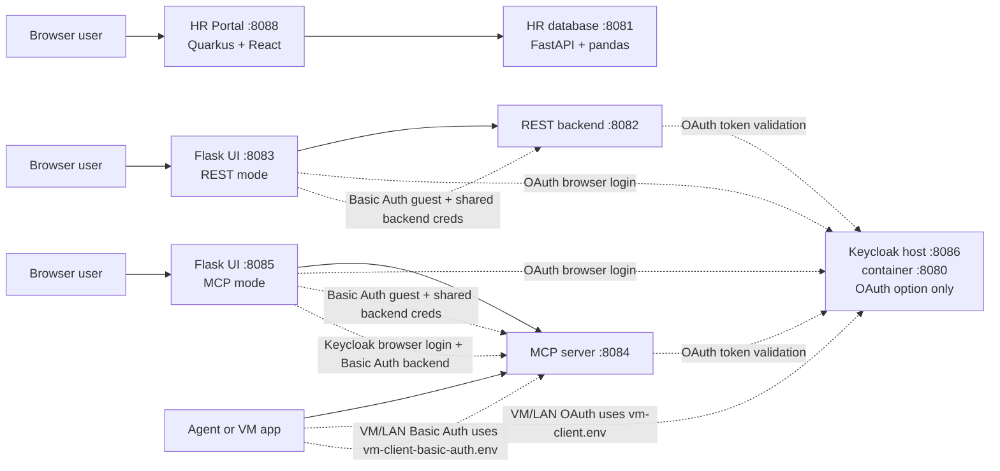

[](https://github.com/thomassuedbroecker/galaxium-travels-infrastructure-tsuedbro/actions/workflows/tests.yml)
[](https://github.com/thomassuedbroecker/galaxium-travels-infrastructure-tsuedbro/actions/workflows/dco.yml)
[](LICENSE)

# Galaxium Travels Infrastructure

## Objective

The main objective of this repository is to provide an example application that combines traditional application infrastructure with AI-ready functionality.

The current implementation uses the same travel-booking business flow in two styles:

- a REST backend and a REST-based web UI
- an MCP server and an MCP-based web UI

This makes it possible to evaluate where AI-oriented integration fits best: in the frontend, in the backend, or in both.

The practical architecture question this project helps you explore is:

Should an AI-ready application stay with REST, move to MCP, or support both?

## What You Can Run

- the same Keycloak OAuth flow for both REST and MCP
- a shared Basic Auth variant for the REST backend, MCP server, REST UI, and MCP UI
- a mixed MCP variant where the browser user logs in with Keycloak but the MCP backend itself uses shared Basic Auth

This repository is not meant to claim that MCP always replaces REST. It is meant to let you compare both approaches on the same business case and make a better architectural decision.

The comparison idea also matches the blog post [Should MCP replace REST for AI-ready applications?](https://suedbroecker.net/2026/03/10/should-mcp-replace-rest-for-ai-ready-applications/).

For deployment, the repository now keeps a single supported IBM Code Engine package in `deployment/ibm-code-engine/`.

Editable source diagram: [architecture/galaxim-travel-infrastructure.drawio](./architecture/galaxim-travel-infrastructure.drawio)



## Why This Repo Is Useful

- You can compare REST and MCP in one small, understandable business domain.
- You can test browser users, backends, and AI-style tool access with both Keycloak OAuth and shared Basic Auth.
- You can compare pure OAuth, pure Basic Auth, and a mixed `Keycloak UI -> MCP Basic Auth` path in the same demo.
- You can run everything on one local machine.
- You can also prepare the stack for a VM or LAN setup where OAuth needs public host URLs.
- The Basic Auth runtime is available as both `local-container/docker_compose.basic-auth.yaml` and `local-container/docker_compose.basic-auth-vm.yaml`.
- You can choose the matching env template for each option: `local-container/vm-client.env.template`, `local-container/basic-auth.env.template`, or `local-container/vm-client-basic-auth.env.template`.

## Architecture At A Glance


```mermaid
flowchart LR
    Browser1["Browser user"] --> UIREST["Flask UI :8083<br/>REST mode"]
    Browser2["Browser user"] --> UIMCP["Flask UI :8085<br/>MCP mode"]
    Browser3["Browser user"] --> HRUI["HR Portal :8088<br/>Quarkus + React"]
    Agent["Agent or VM app"] --> MCP["MCP server :8084"]
    UIREST --> REST["REST backend :8082"]
    UIMCP --> MCP
    HRUI --> HRAPI["HR database :8081<br/>FastAPI + pandas"]
    UIREST -. "OAuth browser login" .-> KC["Keycloak host :8086<br/>container :8080<br/>OAuth option only"]
    UIMCP -. "OAuth browser login" .-> KC
    REST -. "OAuth token validation" .-> KC
    MCP -. "OAuth token validation" .-> KC
    UIREST -. "Basic Auth guest + shared backend creds" .-> REST
    UIMCP -. "Basic Auth guest + shared backend creds" .-> MCP
    UIMCP -. "Keycloak browser login + Basic Auth backend" .-> MCP
    Agent -. "VM/LAN OAuth uses vm-client.env" .-> KC
    Agent -. "VM/LAN Basic Auth uses vm-client-basic-auth.env" .-> MCP
```

## Start Here

- Navigation hub (all paths at a glance): [NAVIGATOR.md](./NAVIGATOR.md)
- New user path: [QUICKSTART.md](./QUICKSTART.md)
- Contributing and DCO sign-off: [CONTRIBUTING.md](./CONTRIBUTING.md)
- Runtime boundaries and architecture decisions: [ARCHITECTURE.md](./ARCHITECTURE.md)
- Local compose, VM/LAN OAuth, and Basic Auth details: [local-container/README.md](./local-container/README.md)
- Test commands and current test scope: [testing/README.md](./testing/README.md)
- AI engineer / agent integration guide: [docs/AI_ENGINEER_GUIDE.md](./docs/AI_ENGINEER_GUIDE.md)
- Manual MCP auth walkthrough with Inspector CLI: [docs/manual_auth_check_using_the_commandline.md](./docs/manual_auth_check_using_the_commandline.md)
- WebUI auth matrix details: [testing/webui_matrix/README.md](./testing/webui_matrix/README.md)
- Project quality review: [docs/QUALITY-CHECK.md](./docs/QUALITY-CHECK.md)
- IBM Code Engine deployment package: [deployment/ibm-code-engine/README.md](./deployment/ibm-code-engine/README.md)

## Main Services

| Path | Purpose | Default port | Main entry point |
| --- | --- | --- | --- |
| `booking_system_rest/` | FastAPI booking backend with independent SQLite state | `8082` | `app.py` |
| `booking_system_mcp/` | MCP server with independent SQLite state for the equivalent booking domain | `8084` | `mcp_server.py` |
| `galaxium-booking-web-app/` | Flask UI that calls the REST backend | `8083` | `app/app.py` |
| `galaxium-booking-web-app-mcp/` | Flask UI that calls MCP tools through a direct Python MCP client | `8085` | `app/app.py` |
| `HR_database/` | Small HR API backed by markdown data | `8081` | `app.py` |
| `hr_database_frontend/` | Quarkus + React HR portal; proxies CRUD calls to `HR_database` | `8088` | `run-hr-app.sh` / `mvn quarkus:dev` |
| `local-container/` | Docker Compose setup, OAuth and Basic Auth verifier scripts, env templates | n/a | `docker_compose.yaml` |

The REST and MCP paths model equivalent traveler actions, but they do not
share a database. A booking created in one path is not synchronized to the
other. See [ARCHITECTURE.md](./ARCHITECTURE.md) for the runtime boundary and
auth-mode comparison.

## Verification Evidence

For test commands, scope, and the current verified state see [testing/README.md](./testing/README.md).

## First-Time Setup

After cloning, run the one-time hook setup so every commit is signed off
automatically (required by the DCO check on pull requests):

```sh
bash setup-hooks.sh
```

## Fast Validation

Run the REST API tests:

```sh
(cd booking_system_rest && python3 -m pytest tests -q)
```

Run the local-container contract tests:

```sh
bash testing/automation/run-local-container-contract-tests.sh
```

Run the compose OAuth smoke test:

```sh
bash local-container/verify-keycloak-auth-e2e.sh
```

Run the local Basic Auth backend smoke test:

```sh
bash local-container/verify-basic-auth-backends.sh
```

Run the local Basic Auth frontend plus Inspector smoke test:

```sh
bash local-container/verify-basic-auth-frontends-and-inspector.sh
```

Run the Keycloak UI + MCP Basic Auth smoke test:

```sh
bash local-container/verify-keycloak-ui-basic-auth-mcp.sh
```

Run the current aggregate repo regression slice:

```sh
bash testing/automation/run-all-tests.sh
```

Run the WebUI auth matrix with the local template:

```sh
cp testing/webui_matrix/local-machine-network.env.template testing/webui_matrix/local-machine-network.env
bash testing/automation/run-webui-auth-matrix.sh --env-file testing/webui_matrix/local-machine-network.env
```

## Open-Source Dependencies

This repository contains multiple Python services, each with its own
`requirements.txt`. It does not currently use a single root lockfile.

The tables below show the direct dependencies declared in the repository as of
`2026-03-31`. Where a service does not pin an exact version, the entry is marked
as `not pinned`.

Current declared base images:

| Service | Base image(s) |
| --- | --- |
| `booking_system_rest/` | `python:3.11-slim` |
| `booking_system_mcp/` | `python:3.11-slim` |
| `HR_database/` | `python:3.11-slim` |
| `galaxium-booking-web-app/` | `python:3.12-slim` |
| `galaxium-booking-web-app-mcp/` | `python:3.12-slim` |
| `hr_database_frontend/` | build: `maven:3.9-eclipse-temurin-21`; runtime: `eclipse-temurin:21-jre-jammy` |

Current declared main runtime libraries:

| Library | Declared version in this repo | License | Where referenced |
| --- | --- | --- | --- |
| `fastapi` | `not pinned`; `0.104.1` in `HR_database/requirements.txt` | MIT | `booking_system_rest/requirements.txt`, `booking_system_mcp/requirements.txt`, `HR_database/requirements.txt` |
| `uvicorn` | `not pinned`; `0.24.0` in `HR_database/requirements.txt` | BSD-3-Clause | `booking_system_rest/requirements.txt`, `booking_system_mcp/requirements.txt`, `HR_database/requirements.txt` |
| `sqlalchemy` | `not pinned` | MIT | `booking_system_rest/requirements.txt`, `booking_system_mcp/requirements.txt` |
| `databases` | `not pinned` | BSD | `booking_system_rest/requirements.txt`, `booking_system_mcp/requirements.txt` |
| `pydantic` / `pydantic[email]` | `not pinned`; `2.4.2` in `HR_database/requirements.txt` | MIT | `booking_system_rest/requirements.txt`, `booking_system_mcp/requirements.txt`, `HR_database/requirements.txt` |
| `python-dotenv` | `not pinned` | BSD-3-Clause | `booking_system_rest/requirements.txt`, `booking_system_mcp/requirements.txt` |
| `fastmcp` | `not pinned` | Apache-2.0 | `booking_system_mcp/requirements.txt` |
| `PyJWT[crypto]` | `not pinned` | MIT | `booking_system_rest/requirements.txt`, `booking_system_mcp/requirements.txt` |
| `python-multipart` | `0.0.6` | Apache-2.0 | `HR_database/requirements.txt` |
| `pandas` | `not pinned` | BSD-3-Clause | `HR_database/Dockerfile` |
| `Flask` | `3.1.1` | BSD-3-Clause | `galaxium-booking-web-app/app/requirements.txt`, `galaxium-booking-web-app-mcp/app/requirements.txt` |
| `flask-cors` | `3.0.10` | MIT | `galaxium-booking-web-app/app/requirements.txt`, `galaxium-booking-web-app-mcp/app/requirements.txt` |
| `requests` | `2.31.0` | Apache-2.0 | `galaxium-booking-web-app/app/requirements.txt`, `galaxium-booking-web-app-mcp/app/requirements.txt` |
| `httpx` | `0.28.1` | BSD-3-Clause | `galaxium-booking-web-app-mcp/app/requirements.txt` |
| `mcp` | `>=1.26.0,<2` | MIT | `galaxium-booking-web-app-mcp/app/requirements.txt` |

Current declared dev and test libraries:

| Library | Declared version in this repo | License | Where referenced |
| --- | --- | --- | --- |
| `pytest` | `not pinned` | MIT | `booking_system_rest/requirements.txt` |
| `pytest-asyncio` | `not pinned` | Apache-2.0 | `booking_system_rest/requirements.txt` |
| `pytest-cov` | `not pinned` | MIT | `booking_system_rest/requirements.txt` |
| `pytest-mock` | `not pinned` | MIT | `booking_system_rest/requirements.txt` |

The repository itself is licensed under Apache-2.0 in `LICENSE`.

Unlike `chaindocs_MCP_example`, this repository does not currently include a
single automated dependency license-audit script at the root. Dependency
declarations are split across the individual service folders.

## Repository Layout

```text
.
├── ARCHITECTURE.md
├── CONTRIBUTING.md
├── NAVIGATOR.md
├── QUICKSTART.md
├── LLMS.txt
├── setup-hooks.sh          ← run once after cloning to auto-sign commits (DCO)
├── .githooks/
│   └── commit-msg          ← appends Signed-off-by to every commit automatically
├── .github/
│   ├── workflows/
│   │   └── dco.yml         ← CI gate: verifies DCO trailer on every PR
│   └── pull_request_template.md
├── docs/
│   ├── AI_ENGINEER_GUIDE.md
│   ├── QUALITY-CHECK.md
│   ├── DEPENDENCY_LICENSE_TRANSPARENCY.md
│   ├── manual_auth_check_using_the_commandline.md
│   ├── watsonx_orchestrate_basic_auth_example_integration.md
│   └── reference/               ← supplemental background (not required for first run)
├── HR_database/             ← FastAPI + pandas HR data API (port 8081)
├── hr_database_frontend/    ← Quarkus + React HR portal (port 8088)
├── booking_system_mcp/
├── booking_system_rest/
├── galaxium-booking-web-app/
├── galaxium-booking-web-app-mcp/
├── local-container/
├── testing/
└── deployment/
```

## Notes

- This repository is a strong demo and learning project, not a finished production platform.
- The code is structured so you can grow it toward production by improving CI, observability, release handling, and shared frontend code.
- `docs/reference/` contains extra background and older notes. It is not required for a first run.
