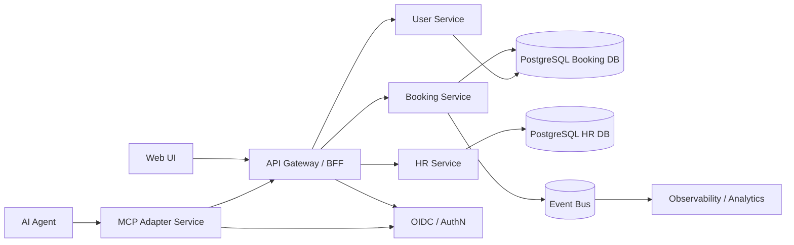

# Suggested Implementation Changes

**This is an AI review!**

## 1. Business Context

Galaxium Travels is currently a demo platform with four runtime components: REST booking API, MCP booking API, HR API, and Flask web UI.  
The business goal for this review is to define the changes required to evolve this repository from demo-quality into enterprise-ready, secure, and AI-integration-ready software.

Current findings (ordered by severity):

- Critical: No authentication or authorization on booking, HR, and MCP endpoints. Sensitive data (user email, employee salary) is exposed without identity controls.
- Critical: Data is reset during startup in booking services (`seed()` deletes all records), which causes guaranteed data loss on restart/deploy.
- Critical: Business errors are returned as `HTTP 200`, which hides failures from API clients, observability systems, and SLO tracking.
- High: CORS is open to all origins and credentials at the same time, creating an insecure browser boundary.
- High: Local compose networking for web-to-backend is fragile (`$(ipconfig getifaddr en0)`), non-portable, and conflicts with container service discovery.
- High: SQLite and markdown file storage are not suitable for concurrent, persistent multi-instance workloads.
- High: No timeout in the web proxy layer; backend calls can hang indefinitely and consume worker capacity.
- Medium: Duplicate booking business logic in REST and MCP services increases drift and maintenance cost.
- Medium: Documentation and deployment details are inconsistent (ports, docs paths, and startup behavior).

## 2. Functional Requirements

The target system should:

- Provide booking and HR APIs with authenticated access and role-based authorization.
- Support AI-agent access through MCP with controlled tool permissions and audit logging.
- Keep existing booking features (`/flights`, `/book`, `/bookings`, `/cancel`, `/register`, `/user_id`) while enforcing secure request context.
- Keep HR CRUD functionality while moving employee data to transactional storage with validation.
- Provide deterministic startup behavior (no destructive reseeding in production).
- Support safe configuration by environment (local demo, staging, production).
- Publish structured health, readiness, and metrics endpoints.

## 3. Non-Functional Requirements

- Security:
  - Enforce OAuth2/OIDC at the edge.
  - Enforce RBAC/ABAC in services.
  - Encrypt data in transit (TLS) and at rest.
  - Remove wildcard CORS and default-open MCP modes.
- Reliability:
  - Define API SLOs (for example 99.9% availability for booking APIs).
  - Add retries/timeouts/circuit breakers on service-to-service calls.
  - Guarantee non-destructive startup and idempotent migrations.
- Scalability:
  - Replace file-based/SQLite persistence with managed relational storage.
  - Support horizontal scaling of stateless services.
- Observability:
  - Use structured logs with correlation IDs.
  - Expose metrics and distributed traces.
  - Track business KPIs (booking success rate, cancellation rate, tool error rate).
- Compliance and governance:
  - Classify and protect PII (emails, HR salaries).
  - Define retention and audit policies.
  - Add AI governance controls for MCP tool usage.
- Cost:
  - Scale web/API services independently.
  - Use autoscaling with sensible min/max replicas.
  - Separate demo seed data from production data paths.

## 4. Proposed Architecture

- Frontend:
  - Keep a lightweight UI, but move to a backend-for-frontend (BFF) pattern with strict outbound policies and request timeout defaults.
- Backend:
  - Split into domain services:
    - Booking Service (core booking logic).
    - User Service (registration and identity profile mapping).
    - HR Service (employee records with access controls).
  - Keep REST APIs for human/system integration.
- AI services:
  - Keep MCP interface, but make it an adapter over Booking Service APIs.
  - Add tool-level policy checks, rate limits, and audit logs.
  - Optionally add RAG only for policy/knowledge use cases (not transactional writes).
- Data layer:
  - Use PostgreSQL for booking and user data.
  - Use a separate HR schema/database with least-privilege access.
  - Use migrations (Alembic) and controlled seed profiles (`demo` only).
- Integration layer:
  - Add asynchronous event publication (booking-created, booking-cancelled) for analytics and AI workflows.
  - Introduce API gateway for auth, rate limiting, and request validation.
- Security layer:
  - OIDC identity provider.
  - JWT validation at gateway and service.
  - Centralized secrets management.

## 5. Architecture Diagram (Optional)

## 6. Technology Stack Suggestion

- API services: FastAPI for all Python services (standardize and simplify ops).
- Data: PostgreSQL (transactional consistency, concurrent writes, mature tooling).
- DB migrations: Alembic (repeatable environment provisioning).
- API gateway: Kong, Apigee, or cloud-native gateway (auth, throttling, policy).
- Auth: OIDC provider (Keycloak, Auth0, Okta, Entra ID).
- Observability: OpenTelemetry + Prometheus + Grafana + centralized logs.
- CI/CD: GitHub Actions with build, test, security scan, and environment promotion.
- Container hardening:
  - Multi-stage builds.
  - Non-root runtime user.
  - Pinned dependencies and vulnerability scanning.

## 7. Risks and Trade-offs

- Moving from SQLite/markdown to PostgreSQL adds migration effort, but removes major data integrity and scaling risks.
- Introducing gateway + auth adds operational complexity, but is mandatory for enterprise security and compliance.
- Unifying duplicated REST/MCP business logic requires refactoring, but significantly reduces long-term defects.
- Strict HTTP error semantics may break existing agent clients that expect `200` for business errors; a transition period with versioned APIs is recommended.
- Full observability stack increases cost, but is required for production incident response and SLA reporting.

## 8. Implementation Roadmap

Phase 0 (1 week): Stabilize and secure basics

- Stop destructive startup seeding in non-demo environments.
- Fix compose networking (`BACKEND_URL=http://booking_system:8082` for local container network).
- Add request timeouts and disable debug mode in web app runtime.
- Close CORS policy to known origins only.

Phase 1 (2-3 weeks): Security and service hardening

- Add API gateway with OIDC auth and rate limits.
- Add RBAC checks for booking and HR operations.
- Introduce structured logging and correlation IDs.
- Add readiness/liveness/health endpoints for all services.

Phase 2 (2-4 weeks): Data and contract modernization

- Migrate booking/user data to PostgreSQL with Alembic migrations.
- Replace HR markdown storage with relational persistence.
- Introduce API versioning and proper HTTP status semantics (`4xx/5xx`).
- Keep a compatibility mode for MCP clients during migration.

Phase 3 (2-3 weeks): AI enterprise controls

- Refactor MCP as an adapter over Booking Service APIs.
- Add tool-level authorization policy and audit trails.
- Add AI governance controls (allowed tools, quota, policy logs).

Phase 4 (1-2 weeks): Operational excellence

- CI/CD with tests, SAST/dependency scan, container scan, and deployment promotion.
- Define SLOs/alerts and run load testing.
- Publish an architecture decision record set for maintainability.
