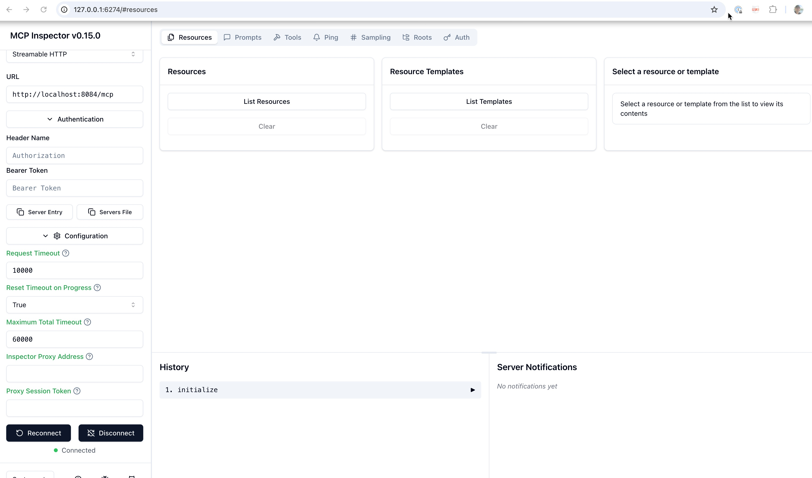
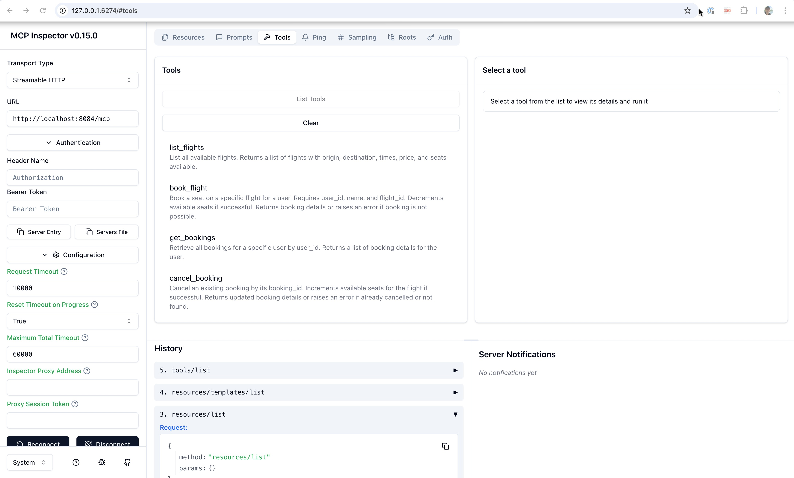

# MCP Deployment (Model Context Protocol)

This service can be deployed as an MCP server, making its booking tools available to LLMs and agentic frameworks via the Model Context Protocol.

## Running Locally

1. Install dependencies:
   ```sh
   pip install -r requirements.txt
   ```
2. Seed the database (optional):
   ```sh
   python seed.py
   ```
3. Start the MCP server:
   ```sh
   python mcp_server.py
   ```
   The server will listen on port 8084 by default.
4. interact with it locally
   ```sh
   export DANGEROUSLY_OMIT_AUTH=true   
   npx @modelcontextprotocol/inspector  
   ```

5. Use `MCP inspector`:

* Connect



* List tools



## OAuth2/OIDC Security

The MCP server uses the same bearer token validation model as `booking_system_rest`.

Environment variables:

- `AUTH_ENABLED` - `true` or `false` (default `false`)
- `OIDC_ISSUER` - OIDC issuer URL (example: `http://keycloak:8080/realms/galaxium`)
- `OIDC_AUDIENCE` - expected audience claim (example: `booking-api`)
- `OIDC_JWKS_URL` - optional JWKS URL override
- `OIDC_AUTHORIZATION_SERVER_URL` - optional host-reachable auth server URL for OAuth metadata discovery (example local: `http://localhost:8080/realms/galaxium`)

When `AUTH_ENABLED=true`, MCP protocol requests require a bearer token in the `Authorization` header.
The root health route (`GET /`) remains public.

For non-compose deployments (for example IBM Cloud Code Engine), set:

1. `AUTH_ENABLED=true`
2. `OIDC_ISSUER=https://<keycloak-host>/realms/galaxium`
3. `OIDC_AUDIENCE=booking-api`
4. `OIDC_JWKS_URL=https://<keycloak-host>/realms/galaxium/protocol/openid-connect/certs`

## Deploying to IBM Code Engine

- Build and push your Docker image (see Dockerfile).
- Deploy to Code Engine, exposing container port `8084`.
- The MCP endpoint will be available at `https://<your-app-url>/mcp`.

---

## MCP Tools

The server exposes booking capabilities through MCP tools (not REST endpoints):

- `list_flights`
- `book_flight`
- `get_bookings`
- `cancel_booking`
- `register_user`
- `get_user_id`

## Error Handling

This MCP server features **enhanced error messages** specifically designed for AI agents using the Model Context Protocol:

### Key Improvements
- **Clear Problem Identification**: Error messages explain exactly what went wrong
- **Tool Suggestions**: Specific MCP tools are suggested for resolution
- **Context Information**: Relevant details about the failure are provided
- **AI-Friendly Format**: Messages are structured to help AI agents make decisions

### Example Error Messages
```python
# Before: Generic error
Exception: "User not found"

# After: Actionable error with tool suggestions
Exception: "User with ID 999 is not registered in our system. The user might need to register first using the register_user tool, or you may need to check if the user_id is correct."
```

### Error Scenarios Covered
- **Flight not found**: Suggests using `list_flights` tool
- **User not found**: Distinguishes between unregistered users and name mismatches
- **No seats available**: Suggests checking other flights
- **Booking errors**: Provides context and verification steps
- **Duplicate registration**: Suggests using `get_user_id` tool

### MCP Tool Integration
All error messages are designed to work seamlessly with MCP tools:
- **Flight operations**: `list_flights`, `book_flight`
- **User management**: `register_user`, `get_user_id`
- **Booking management**: `get_bookings`, `cancel_booking`

For comprehensive error handling documentation, see the [Error Handling Guide](../booking_system_rest/docs/error-handling-guide.md) and [Error Handling Examples](../booking_system_rest/docs/error-handling-examples.md).

---

This is a demo system and not intended for production use. 
