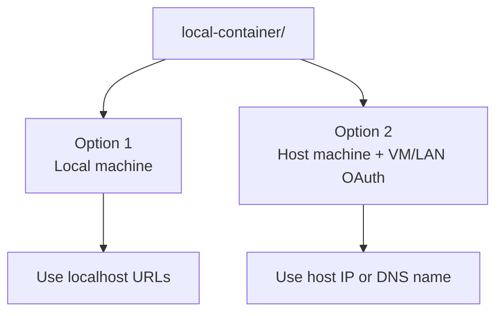
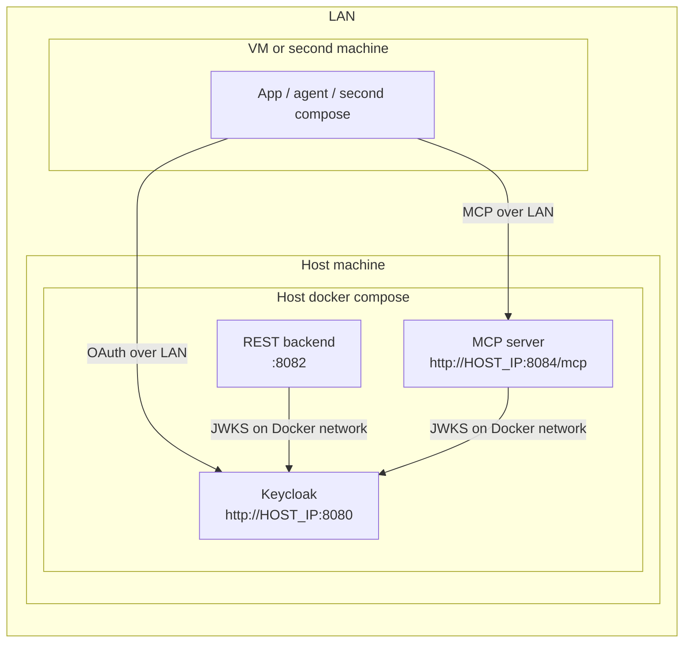

# Local Container Guide

This folder contains the runnable Docker Compose setup for the Galaxium demo.

You can use it in two ways:

- run everything on one local machine
- run the protected stack on the host machine and let another app or agent connect from a VM or another machine in the LAN

## Two Runtime Options



## Option 1: Local Machine

Use this when all services run on one machine.

### Start

From this folder run:

```sh
docker compose up --build
```

Start only the REST path:

```sh
docker compose up --build keycloak booking_system web_app
```

Start only the MCP path:

```sh
docker compose up --build keycloak booking_system_mcp web_app_mcp
```

If you start only one path, only the matching backend and frontend URLs will be available.

### Local URLs

- Keycloak: `http://localhost:8080`
- HR API docs: `http://localhost:8081/docs`
- Booking REST API docs: `http://localhost:8082/docs`
- REST web UI: `http://localhost:8083`
- MCP endpoint: `http://localhost:8084/mcp`
- MCP web UI: `http://localhost:8085`

### Built-In Credentials

- Keycloak admin: `admin` / `admin`
- Traveler user: `demo-user` / `demo-user-password`

The Keycloak realm is imported automatically from `keycloak/realm/galaxium-realm.json`.

## Option 2: Host Machine + VM / LAN OAuth

Use this when:

- the Galaxium stack runs on the host machine
- a second app or agent runs inside a VM or on another machine
- OAuth and MCP must work through the host IP or DNS name

Source diagram: [network-configuration.drawio](../../network-configuration.drawio)



### Why This OAuth Setup Works

The main problem in split host and VM setups is the token issuer.

Without the override:

- the VM gets a token from `http://HOST_IP:8080`
- the token issuer becomes `http://HOST_IP:8080/realms/galaxium`
- but containers may still validate against `http://keycloak:8080/realms/galaxium`
- that causes `invalid_token`

With `docker_compose.vm-oauth.yaml`:

1. Keycloak advertises the public host URL.
2. REST and MCP validate the same public issuer.
3. JWKS download still stays on the Docker network at `http://keycloak:8080/.../certs`.
4. VM-side clients use the host IP or DNS name, not `localhost`.

This gives you:

- public OAuth URLs for the VM-side client
- internal Docker backchannel traffic for container-to-container verification

### Start The Host Stack

1. Copy the env template:

```sh
cp vm-oauth.env.template vm-oauth.env
```

2. Edit `vm-oauth.env`:

```sh
KEYCLOAK_PUBLIC_BASE_URL=http://192.168.1.50:8080
MCP_PUBLIC_BASE_URL=http://192.168.1.50:8084
```

3. Start the stack:

```sh
docker compose --env-file vm-oauth.env \
  -f docker_compose.yaml \
  -f docker_compose.vm-oauth.yaml \
  up --build -d
```

Start only the REST path:

```sh
docker compose --env-file vm-oauth.env \
  -f docker_compose.yaml \
  -f docker_compose.vm-oauth.yaml \
  up --build -d keycloak booking_system web_app
```

Start only the MCP path:

```sh
docker compose --env-file vm-oauth.env \
  -f docker_compose.yaml \
  -f docker_compose.vm-oauth.yaml \
  up --build -d keycloak booking_system_mcp web_app_mcp
```

### VM-Side Client Settings

Copy the client template:

```sh
cp vm-client.env.template vm-client.env
```

Edit `vm-client.env`:

```sh
KEYCLOAK_BASE_URL=http://192.168.1.50:8080
KEYCLOAK_TOKEN_URL=http://192.168.1.50:8080/realms/galaxium/protocol/openid-connect/token
MCP_SERVER_URL=http://192.168.1.50:8084/mcp
```

Do not use `localhost` for this option.

### Verify The LAN-Facing Setup

```sh
cp verify-keycloak-auth-remote.env.template verify-keycloak-auth-remote.env
bash verify-keycloak-auth-remote.sh --env-file verify-keycloak-auth-remote.env
```

Useful manual checks:

```sh
curl -s http://192.168.1.50:8080/realms/galaxium/.well-known/openid-configuration | jq -r .issuer
curl -s http://192.168.1.50:8084/.well-known/oauth-authorization-server | jq .
```

Expected:

- Keycloak issuer uses `http://192.168.1.50:8080/realms/galaxium`
- MCP metadata uses the same issuer
- MCP registration endpoint uses `http://192.168.1.50:8084/oauth/register`

## Verification Scripts

Run the complete local OAuth smoke test:

```sh
bash verify-keycloak-auth-e2e.sh
```

Run focused checks:

```sh
bash verify-keycloak-auth.sh
bash verify-keycloak-auth-mcp.sh
```

Run the lightweight MCP CLI test:

```sh
python3 mcp_test_app.py
```

Reports are written to `test-results/`.

## MCP Inspector

Use this only when you want to inspect the MCP server manually.

1. Start the compose stack.
2. Run:

```sh
bash start-mcp-inspector-ui.sh
```

3. Open the URL printed by the script.
4. Use:
   - Transport: `Streamable HTTP`
   - URL: `http://localhost:8084/mcp`
   - Connection type: `Via Proxy`

For the VM/LAN option, replace `localhost` with the host IP or DNS name.

## Stop

Stop the local stack:

```sh
docker compose down
```

Stop the VM/LAN host stack:

```sh
docker compose --env-file vm-oauth.env \
  -f docker_compose.yaml \
  -f docker_compose.vm-oauth.yaml \
  down
```

## Related Docs

- Repository quickstart: [../QUICKSTART.md](../QUICKSTART.md)
- Testing guide: [../testing/README.md](../testing/README.md)
- WebUI auth matrix: [../testing/webui_matrix/README.md](../testing/webui_matrix/README.md)
