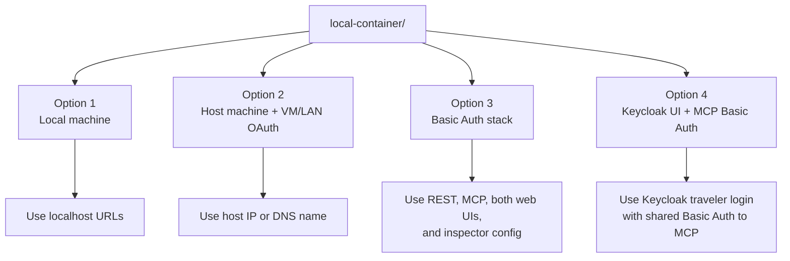
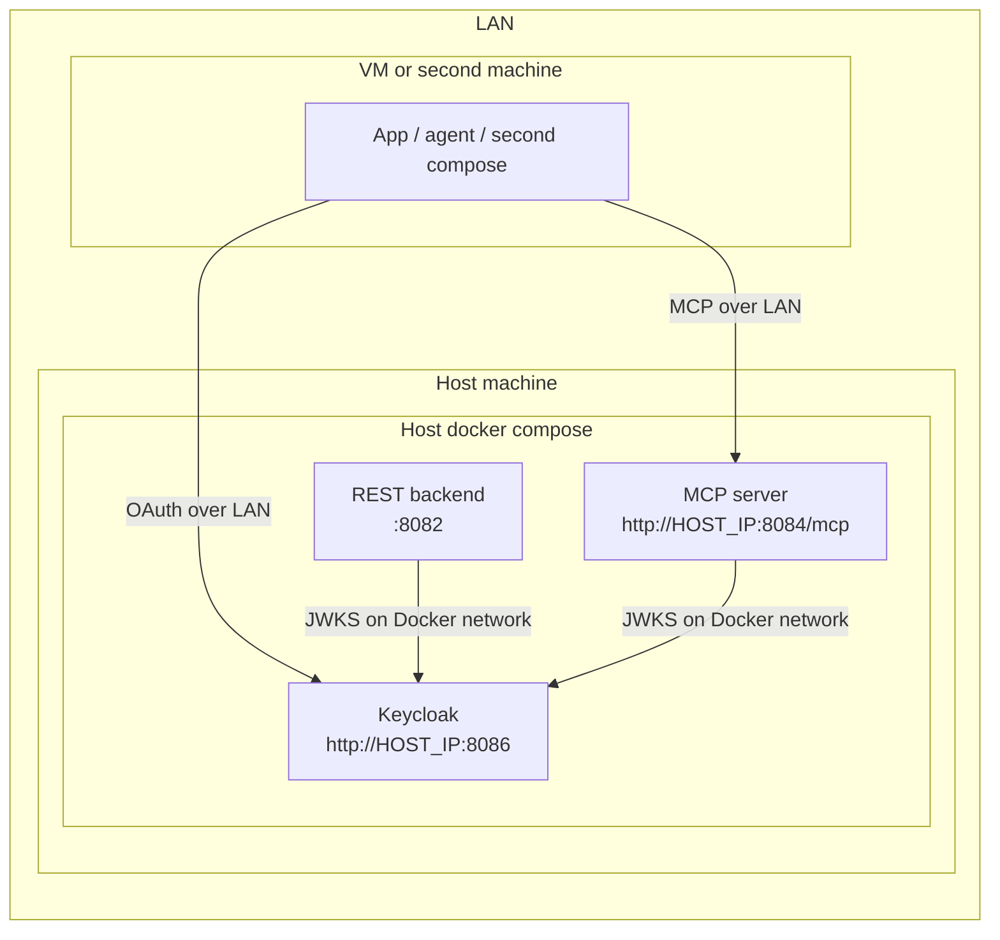

# Local Container Guide

This folder contains the runnable Docker Compose setup for the Galaxium demo.

You can use it in four ways:

- run everything on one local machine
- run the protected stack on the host machine and let another app or agent connect from a VM or another machine in the LAN
- run the REST path, MCP path, and inspector tooling in a small Basic Auth variant without Keycloak
- run the MCP UI with Keycloak browser login while the MCP backend itself uses shared Basic Auth

## Runtime Options


```mermaid
flowchart TD
    A["local-container/"] --> B["Option 1<br/>Local machine"]
    A --> C["Option 2<br/>Host machine + VM/LAN OAuth"]
    A --> F["Option 3<br/>Basic Auth stack"]
    A --> H["Option 4<br/>Keycloak UI + MCP Basic Auth"]
    B --> D["Use localhost URLs"]
    C --> E["Use host IP or DNS name"]
    F --> G["Use REST, MCP, both web UIs,<br/>and inspector config"]
    H --> I["Use Keycloak traveler login<br/>with shared Basic Auth to MCP"]
```

## Option 1: Local Machine

Use this when all services run on one machine.

### Start

From this folder run:

```sh
export LOCAL_NET_IP=$(ipconfig getifaddr en0)
docker compose up --build
```

Start only the REST path:

```sh
cd local-container
export LOCAL_NET_IP=$(ipconfig getifaddr en0)
docker compose up --build keycloak booking_system web_app
```

Start only the MCP path:

```sh
cd local-container
export LOCAL_NET_IP=$(ipconfig getifaddr en0)
docker compose up --build keycloak booking_system_mcp web_app_mcp
```

If you start only one path, only the matching backend and frontend URLs will be available.

### Local URLs

- Keycloak: `http://localhost:8086`
- HR API docs: `http://localhost:8081/docs`
- Booking REST API docs: `http://localhost:8082/docs`
- REST web UI: `http://localhost:8083`
- MCP endpoint: `http://localhost:8084/mcp`
- MCP web UI: `http://localhost:8085`

### Built-In Credentials

- Keycloak admin: `admin` / `admin`
- Traveler user: `demo-user` / `demo-user-password`

The Keycloak realm is imported automatically from `keycloak/realm/galaxium-realm.json`.

## Option 2: Host Machine + VM / LAN OAuth

Use this when:

- the Galaxium stack runs on the host machine
- a second app or agent runs inside a VM or on another machine
- OAuth and MCP must work through the host IP or DNS name

Source diagram: [network-configuration.drawio](../../network-configuration.drawio)


```mermaid
flowchart LR
  subgraph lan["LAN"]
    subgraph host["Host machine"]
      subgraph host_compose["Host docker compose"]
        kc["Keycloak<br/>http://HOST_IP:8086"]
        rest["REST backend<br/>:8082"]
        mcp["MCP server<br/>http://HOST_IP:8084/mcp"]
      end
    end

    subgraph vm["VM or second machine"]
      app["App / agent / second compose"]
    end
  end

  app -->|"OAuth over LAN"| kc
  app -->|"MCP over LAN"| mcp
  rest -->|"JWKS on Docker network"| kc
  mcp -->|"JWKS on Docker network"| kc
```

### Why This OAuth Setup Works

The main problem in split host and VM setups is the token issuer.

Without the override:

- the VM gets a token from `http://HOST_IP:8086`
- the token issuer becomes `http://HOST_IP:8086/realms/galaxium`
- but containers may still validate against `http://keycloak:8080/realms/galaxium`
- that causes `invalid_token`

With `docker_compose.vm-oauth.yaml`:

1. Keycloak advertises the public host URL.
2. REST and MCP validate the same public issuer.
3. JWKS download still stays on the Docker network at `http://keycloak:8080/.../certs`.
4. The REST and MCP web UIs use the public Keycloak token URL, so traveler login produces tokens with the LAN-facing issuer.
5. VM-side clients use the host IP or DNS name, not `localhost`.

This gives you:

- public OAuth URLs for the VM-side client
- internal Docker backchannel traffic for container-to-container verification

### Start The Host Stack

1. Copy the env template and get IP address:

```sh
cd local-container
export LOCAL_NET_IP=$(ipconfig getifaddr en0)
cp vm-oauth.env.template vm-oauth.env
```

2. Edit `vm-oauth.env`:

```sh
KEYCLOAK_PUBLIC_HOSTNAME=${LOCAL_NET_IP}
KEYCLOAK_PUBLIC_BASE_URL=http://${LOCAL_NET_IP}:8086
MCP_PUBLIC_BASE_URL=http://${LOCAL_NET_IP}:8084
```

3. Start the stack:

```sh
cd local-container
export LOCAL_NET_IP=$(ipconfig getifaddr en0)
docker compose --env-file vm-oauth.env \
  -f docker_compose.yaml \
  -f docker_compose.vm-oauth.yaml \
  up --build -d
```

Start only the REST path:

```sh
cd local-container
export LOCAL_NET_IP=$(ipconfig getifaddr en0)
docker compose --env-file vm-oauth.env \
  -f docker_compose.yaml \
  -f docker_compose.vm-oauth.yaml \
  up --build -d keycloak booking_system web_app
```

Start only the MCP path:

```sh
cd local-container
export LOCAL_NET_IP=$(ipconfig getifaddr en0)
docker compose --env-file vm-oauth.env \
  -f docker_compose.yaml \
  -f docker_compose.vm-oauth.yaml \
  up --build -d keycloak booking_system_mcp web_app_mcp
```

### VM-Side Client Settings

Copy the env template and get IP address:

```sh
export LOCAL_NET_IP=$(ipconfig getifaddr en0)
cp vm-client.env.template vm-client.env
```

Edit `vm-client.env`:

```sh
KEYCLOAK_BASE_URL=http://${LOCAL_NET_IP}:8086
KEYCLOAK_TOKEN_URL=http://${LOCAL_NET_IP}:8086/realms/galaxium/protocol/openid-connect/token
MCP_SERVER_URL=http://${LOCAL_NET_IP}:8084/mcp
```

Do not use `localhost` for this option.

### Verify The LAN-Facing Setup

```sh
cp verify-keycloak-auth-remote.env.template verify-keycloak-auth-remote.env
bash verify-keycloak-auth-remote.sh --env-file verify-keycloak-auth-remote.env
```

Useful manual checks:

```sh
cd local-container
export LOCAL_NET_IP=$(ipconfig getifaddr en0)
curl -s http://${LOCAL_NET_IP}:8086/realms/galaxium/.well-known/openid-configuration | jq -r .issuer
curl -s http://${LOCAL_NET_IP}:8084/.well-known/oauth-authorization-server | jq .
python3 mcp_test_app.py --mcp-url http://192.168.1.50:8084/mcp --token-source http --token-url http://192.168.1.50:8086/realms/galaxium/protocol/openid-connect/token
```

Expected:

- Keycloak issuer uses `http://192.168.1.50:8086/realms/galaxium`
- MCP metadata uses the same issuer
- MCP registration endpoint uses `http://192.168.1.50:8084/oauth/register`
- MCP token-authenticated initialize and `tools/list` calls succeed over the LAN URL

## Option 3: Basic Auth Stack

Use this when:

- you want the REST API, MCP server, REST UI, and MCP UI without Keycloak
- you do not need Keycloak
- you want shared backend Basic Auth instead of traveler browser login

### Start

Prepare the env file:

```sh
cd local-container
cp basic-auth.env.template basic-auth.env
```

Edit `basic-auth.env` if you want credentials other than the demo defaults.

Start the stack:

```sh
cd local-container
docker compose --env-file basic-auth.env -f docker_compose.basic-auth.yaml up --build -d
```

### URLs

- Booking REST API docs: `http://localhost:8082/docs`
- REST web UI: `http://localhost:8083`
- MCP endpoint: `http://localhost:8084/mcp`
- MCP web UI: `http://localhost:8085`

### Built-In Credentials

- Basic Auth user: `demo-basic-user`
- Basic Auth password: `demo-basic-password`

In this mode the web UIs do not require browser login. Instead, each UI stores a guest traveler profile in the browser session and uses the shared backend Basic Auth credentials for backend calls.

If a VM-side client or another machine reaches this Basic Auth stack through the host IP or DNS name, use the matching client env template:

```sh
export LOCAL_NET_IP=$(ipconfig getifaddr en0)
cp vm-client-basic-auth.env.template vm-client-basic-auth.env
```

Edit `vm-client-basic-auth.env`:

```sh
MCP_SERVER_URL=http://${LOCAL_NET_IP}:8084/mcp
BASIC_AUTH_USERNAME=demo-basic-user
BASIC_AUTH_PASSWORD=demo-basic-password
```

### Verify

```sh
cd local-container
bash verify-basic-auth-backends.sh
bash verify-basic-auth-frontends-and-inspector.sh
```

## Option 4: Keycloak UI + MCP Basic Auth

Use this when:

- you want the MCP web UI to keep traveler browser login in Keycloak
- you want the MCP backend itself to require the shared Basic Auth header
- you only need the MCP path for this mixed mode

### Start

Prepare the env file:

```sh
cd local-container
cp basic-auth.env.template basic-auth.env
```

Edit `basic-auth.env` if you want credentials other than the demo defaults.

Start the mixed stack:

```sh
cd local-container
docker compose --env-file basic-auth.env \
  -f docker_compose.yaml \
  -f docker_compose.mcp-ui-keycloak-basic.yaml \
  up --build -d keycloak booking_system_mcp web_app_mcp
```

### URLs

- Keycloak: `http://localhost:8086`
- MCP endpoint: `http://localhost:8084/mcp`
- MCP web UI: `http://localhost:8085`

### Built-In Credentials

- Traveler browser login: `demo-user` / `demo-user-password`
- Shared Basic Auth for MCP: `demo-basic-user` / `demo-basic-password`

In this mode the browser session stays in Keycloak, but MCP tool calls from the UI use the shared backend Basic Auth credentials from `basic-auth.env`.

### Verify

```sh
cd local-container
bash verify-keycloak-ui-basic-auth-mcp.sh
```

## Verification Scripts

Run the complete local OAuth smoke test:

```sh
bash verify-keycloak-auth-e2e.sh
```

Run focused checks:

```sh
bash verify-keycloak-auth.sh
bash verify-keycloak-auth-mcp.sh
```

Run the lightweight MCP CLI test:

```sh
python3 mcp_test_app.py
```

Run the Basic Auth backend variant:

```sh
cp basic-auth.env.template basic-auth.env
docker compose --env-file basic-auth.env -f docker_compose.basic-auth.yaml up --build -d
bash verify-basic-auth-backends.sh
bash verify-basic-auth-frontends-and-inspector.sh
```

Run the Keycloak UI + MCP Basic Auth variant:

```sh
cp basic-auth.env.template basic-auth.env
docker compose --env-file basic-auth.env \
  -f docker_compose.yaml \
  -f docker_compose.mcp-ui-keycloak-basic.yaml \
  up --build -d keycloak booking_system_mcp web_app_mcp
bash verify-keycloak-ui-basic-auth-mcp.sh
```

Default Basic Auth demo credentials:

- `demo-basic-user`
- `demo-basic-password`

Reports are written to `test-results/`.

## MCP Inspector

Use this only when you want to inspect the MCP server manually.

1. Start the compose stack.
2. Run:

```sh
bash start-mcp-inspector-ui.sh
```

3. Open the URL printed by the script.
4. Use:
   - Transport: `Streamable HTTP`
   - URL: `http://localhost:8084/mcp`
   - Connection type: `Via Proxy`

For the VM/LAN option, replace `localhost` with the host IP or DNS name.

For the Basic Auth stack, generate the inspector config like this:

```sh
MCP_AUTH_SCHEME=basic \
BASIC_AUTH_USERNAME=demo-basic-user \
BASIC_AUTH_PASSWORD=demo-basic-password \
bash start-mcp-inspector-ui.sh
```

If you only want to verify the generated config without opening the Inspector UI:

```sh
INSPECTOR_AUTO_START=0 \
MCP_AUTH_SCHEME=basic \
BASIC_AUTH_USERNAME=demo-basic-user \
BASIC_AUTH_PASSWORD=demo-basic-password \
bash start-mcp-inspector-ui.sh
```

Keep the MCP transport on `Streamable HTTP`. Do not switch the inspector to another transport for this repository.

## Stop

Stop the local stack:

```sh
docker compose down
```

Stop the VM/LAN host stack:

```sh
docker compose --env-file vm-oauth.env \
  -f docker_compose.yaml \
  -f docker_compose.vm-oauth.yaml \
  down
```

Stop the Basic Auth stack:

```sh
docker compose --env-file basic-auth.env -f docker_compose.basic-auth.yaml down
```

Stop the Keycloak UI + MCP Basic Auth stack:

```sh
docker compose --env-file basic-auth.env \
  -f docker_compose.yaml \
  -f docker_compose.mcp-ui-keycloak-basic.yaml \
  down
```

## Related Docs

- Repository quickstart: [../QUICKSTART.md](../QUICKSTART.md)
- Testing guide: [../testing/README.md](../testing/README.md)
- WebUI auth matrix: [../testing/webui_matrix/README.md](../testing/webui_matrix/README.md)
