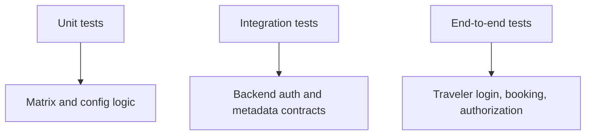

# Testing

This folder is the main entry point for automated checks in this repository.

## What Is Covered

- REST API tests from `booking_system_rest/tests/`
- local UI behavior checks against the compose stack
- local MCP integration checks against the compose stack
- the WebUI auth matrix for:
  - REST and MCP
  - local machine and LAN-prepare environments
  - backend-and-UI OAuth and UI-only OAuth

## Test Layers



## Current Verified State

Current WebUI auth matrix result:

- Command:

  ```sh
  WEBUI_TEST_PUBLIC_HOST=192.168.2.88 \
  WEBUI_TEST_RUN_DOCKER=1 \
  WEBUI_TEST_SKIP_BUILD=1 \
  WEBUI_TEST_RUN_FULL_MATRIX=1 \
  python3 -m unittest discover -s testing/webui_matrix/tests -p 'test_*.py' -v
  ```

- Result: `52 tests passed`
- Skipped: `0`

This means:

- both environments work
- both backend modes work
- both OAuth modes work
- the test generator now runs only real applicable tests

## Folder Structure

```text
testing/
├── README.md
├── automation/
│   ├── run-all-tests.sh
│   ├── run-mcp-integration-tests.sh
│   ├── run-rest-api-tests.sh
│   ├── run-ui-behavior-tests.sh
│   └── run-webui-auth-matrix.sh
├── webui_matrix/
│   ├── README.md
│   ├── matrix.json
│   ├── docker_compose.auth-matrix.yaml
│   ├── *.env.template
│   ├── webui_test_matrix/
│   └── tests/
└── results/
```

## Fast Commands

Run everything:

```sh
bash testing/automation/run-all-tests.sh
```

Run only the REST API suite:

```sh
bash testing/automation/run-rest-api-tests.sh
```

Run only the UI behavior checks:

```sh
bash testing/automation/run-ui-behavior-tests.sh
```

Run only the MCP integration checks:

```sh
bash testing/automation/run-mcp-integration-tests.sh
```

## WebUI Auth Matrix

Run the default local-machine matrix slice:

```sh
cp testing/webui_matrix/local-machine-network.env.template testing/webui_matrix/local-machine-network.env
bash testing/automation/run-webui-auth-matrix.sh --env-file testing/webui_matrix/local-machine-network.env
```

Run the full eight-variant matrix:

```sh
cp testing/webui_matrix/full-matrix.env.template testing/webui_matrix/full-matrix.env
bash testing/automation/run-webui-auth-matrix.sh --env-file testing/webui_matrix/full-matrix.env
```

The matrix runner supports:

```sh
bash testing/automation/run-webui-auth-matrix.sh --env-file <path>
```

## What The WebUI Matrix Checks

- the login page clearly shows `REST API` or `MCP`
- `/` redirects to `/login`
- unauthenticated UI API calls return `401`
- traveler login creates a working session
- authenticated travelers can list flights and book flights
- travelers cannot read another traveler’s bookings
- backend auth can be turned on or off
- LAN-prepare metadata returns public OAuth URLs where needed

## Related Docs

- Main quickstart: [../QUICKSTART.md](../QUICKSTART.md)
- Local compose and VM/LAN guide: [../local-container/README.md](../local-container/README.md)
- WebUI auth matrix details: [./webui_matrix/README.md](./webui_matrix/README.md)
