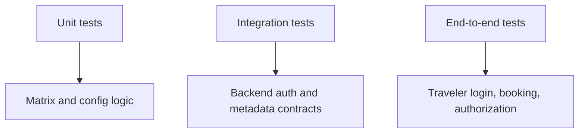

# Testing

This folder is the main entry point for automated checks in this repository.

## What Is Covered

- REST API tests from `booking_system_rest/tests/`
- local UI behavior checks against the compose stack
- local MCP integration checks against the compose stack
- local Basic Auth smoke checks for backends, frontends, and MCP inspector config
- local mixed-mode smoke for Keycloak browser login on the MCP UI with Basic Auth on the MCP backend
- deployment contract checks for the IBM Code Engine package
- the WebUI auth matrix for:
  - REST and MCP
  - local machine and LAN-prepare environments
  - backend-and-UI OAuth and UI-only OAuth

## Test Layers


```mermaid
flowchart TD
    Unit["Unit tests"] --> Matrix["Matrix and config logic"]
    Integration["Integration tests"] --> Contracts["Backend auth and metadata contracts"]
    E2E["End-to-end tests"] --> Flows["Traveler login, booking, authorization"]
```

## Keycloak Port Model In Tests

The repository uses two different Keycloak URLs during testing, and both are correct:

- `http://keycloak:8080/...`
  Used for container-to-container traffic on the Docker network.
- `http://localhost:8086/...` or `http://<PUBLIC_HOST>:8086/...`
  Used for host-side or LAN-side traffic.

These URLs point to the same Keycloak instance.
The host port mapping is `8086:8080`, so the tests must use the URL that matches where the caller is running.

Examples:

- Docker-backed helpers that run inside a container, or use `docker exec`, should keep `keycloak:8080`.
- Host-side scripts such as `verify-keycloak-auth-e2e.sh` use `localhost:8086`.
- LAN-prepare matrix runs and VM/LAN verification use `http://<PUBLIC_HOST>:8086`.

Do not replace `keycloak:8080` with `8086` blindly in test code.
If the caller runs inside Docker, `8080` is the correct target.

## Current Verified State

Current verified checks are split between smoke coverage and the last full matrix run:

- `2026-03-24`: `bash testing/automation/run-code-engine-contract-tests.sh`
  - passed with `6/6` tests green
  - artifact:
    - `testing/results/generated/contracts/code-engine-contracts-20260324T101509Z.log`
- `2026-03-23`: `bash testing/automation/run-all-tests.sh`
  - passed for local-container contracts, REST pytest, UI OAuth smoke, MCP OAuth smoke, and Keycloak UI -> MCP Basic Auth smoke
  - artifacts:
    - `testing/results/generated/contracts/local-container-contracts-20260323T200030Z.log`
    - `testing/results/generated/rest/rest-api-pytest-20260323T200031Z.log`
    - `testing/results/generated/ui/oauth-e2e-ui-rest-20260323T200045Z.md`
    - `testing/results/generated/mcp/oauth-e2e-mcp-20260323T200102Z.md`
    - `testing/results/generated/mcp/keycloak-ui-basic-auth-mcp-20260323T200115Z.md`
- `2026-03-24`: `python3 -m unittest testing.test_local_container_contracts -v`
  - passed with `17/17` tests green
- `2026-03-23`: `bash testing/automation/run-ui-behavior-tests.sh`
  - passed for the local UI OAuth slice with report `testing/results/generated/ui/oauth-e2e-ui-rest-20260323T200045Z.md`
- `2026-03-23`: `bash testing/automation/run-mcp-integration-tests.sh`
  - passed for the MCP OAuth slice and the mixed Keycloak UI -> MCP Basic Auth slice
  - reports:
    - `testing/results/generated/mcp/oauth-e2e-mcp-20260323T200102Z.md`
    - `testing/results/generated/mcp/keycloak-ui-basic-auth-mcp-20260323T200115Z.md`
- `2026-03-23`: `bash local-container/verify-basic-auth-backends.sh`
  - passed for REST Basic Auth and MCP Basic Auth
- `2026-03-23`: `bash local-container/verify-basic-auth-frontends-and-inspector.sh`
  - passed for REST UI guest flow, MCP UI guest flow, and Basic Auth inspector config generation over `Streamable HTTP`
- `2026-03-23`: `bash local-container/verify-keycloak-ui-basic-auth-mcp.sh`
  - passed for Keycloak browser login on the MCP UI with Basic Auth enforcement on the MCP backend
- `2026-03-18`: `python3 -m unittest testing.webui_matrix.tests.unit.test_config -v`
  - passed with `11/11` tests green
- `2026-03-18`: full eight-variant WebUI auth matrix
  - command:

    ```sh
    WEBUI_TEST_PUBLIC_HOST=192.168.2.88 \
    WEBUI_TEST_RUN_DOCKER=1 \
    WEBUI_TEST_SKIP_BUILD=1 \
    WEBUI_TEST_RUN_FULL_MATRIX=1 \
    python3 -m unittest discover -s testing/webui_matrix/tests -p 'test_*.py' -v
    ```
  - result: `55 tests passed`
  - skipped: `0`
- `2026-03-23`: VM / LAN remote auth verification against `192.168.178.154`
  - `bash local-container/verify-keycloak-auth-remote.sh` passed for booking API bearer-token enforcement, traveler web login, and authenticated web app access
  - MCP metadata checks passed for `/.well-known/oauth-authorization-server` and `/.well-known/oauth-protected-resource`
  - `python3 local-container/mcp_test_app.py --mcp-url http://192.168.178.154:8084/mcp --token-source http --token-url http://192.168.178.154:8086/realms/galaxium/protocol/openid-connect/token` passed

## Folder Structure

```text
testing/
├── README.md
├── automation/
│   ├── run-all-tests.sh
│   ├── run-code-engine-contract-tests.sh
│   ├── run-mcp-integration-tests.sh
│   ├── run-rest-api-tests.sh
│   ├── run-ui-behavior-tests.sh
│   └── run-webui-auth-matrix.sh
├── webui_matrix/
│   ├── README.md
│   ├── matrix.json
│   ├── docker_compose.auth-matrix.yaml
│   ├── *.env.template
│   ├── webui_test_matrix/
│   └── tests/
└── results/
```

## Fast Commands

Run everything:

```sh
bash testing/automation/run-all-tests.sh
```

Run only the REST API suite:

```sh
bash testing/automation/run-rest-api-tests.sh
```

Run only the Code Engine deployment contract suite:

```sh
bash testing/automation/run-code-engine-contract-tests.sh
```

Run only the UI behavior checks:

```sh
bash testing/automation/run-ui-behavior-tests.sh
```

Run only the MCP integration checks:

```sh
bash testing/automation/run-mcp-integration-tests.sh
```

Run the local Basic Auth backend smoke:

```sh
bash local-container/verify-basic-auth-backends.sh
```

Run the local Basic Auth frontend plus inspector smoke:

```sh
bash local-container/verify-basic-auth-frontends-and-inspector.sh
```

Run the Keycloak UI + MCP Basic Auth smoke:

```sh
bash local-container/verify-keycloak-ui-basic-auth-mcp.sh
```

## WebUI Auth Matrix

Run the default local-machine matrix slice:

```sh
cp testing/webui_matrix/local-machine-network.env.template testing/webui_matrix/local-machine-network.env
bash testing/automation/run-webui-auth-matrix.sh --env-file testing/webui_matrix/local-machine-network.env
```

Run the full eight-variant matrix:

```sh
cp testing/webui_matrix/full-matrix.env.template testing/webui_matrix/full-matrix.env
bash testing/automation/run-webui-auth-matrix.sh --env-file testing/webui_matrix/full-matrix.env
```

The matrix runner supports:

```sh
bash testing/automation/run-webui-auth-matrix.sh --env-file <path>
```

## What The WebUI Matrix Checks

- the login page clearly shows `REST API` or `MCP`
- `/` redirects to `/login`
- unauthenticated UI API calls return `401`
- traveler login creates a working session
- authenticated travelers can list flights and book flights
- travelers cannot read another traveler’s bookings
- backend auth can be turned on or off
- LAN-prepare metadata returns public OAuth URLs where needed

## Related Docs

- Main quickstart: [../QUICKSTART.md](../QUICKSTART.md)
- Local compose and VM/LAN guide: [../local-container/README.md](../local-container/README.md)
- WebUI auth matrix details: [./webui_matrix/README.md](./webui_matrix/README.md)
