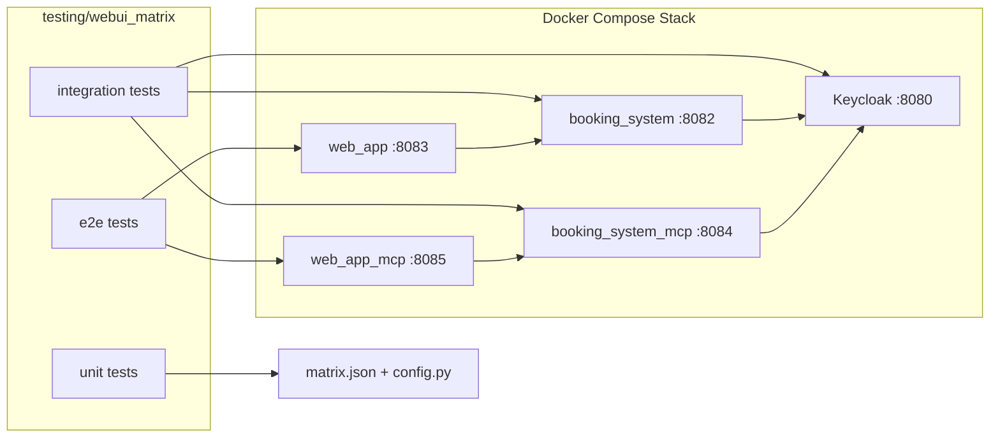

# WebUI Auth Matrix

## 1. architecture overview

This suite adds a dedicated production-style test architecture for the two WebUI variants:

- REST-backed UI on `:8083`
- MCP-backed UI on `:8085`

It validates both runtime topologies that matter in this repository:

- `Local Machine Network`
  The whole stack runs on one machine and uses `localhost`.
- `Local Machine Local Network (Prepare)`
  The stack still runs locally, but the compose override advertises a host-LAN IP or DNS name so a VM or another machine can complete OAuth correctly.

The test matrix covers these variants in each environment:

- `REST + backend and UI OAuth`
- `REST + UI OAuth`
- `MCP + backend and UI OAuth`
- `MCP + UI OAuth`

Design goals:

- one declarative matrix, not hard-coded shell duplication
- shared HTTP, auth, and compose helpers
- unit tests for matrix logic
- integration tests for backend auth and metadata contracts
- end-to-end tests for real traveler login, session, booking flow, and authorization

Current verified state:

- full matrix result: `52 passed`
- skipped tests: `0`
- environments covered:
  - `local_machine_network`
  - `local_machine_local_network_prepare`
- backend modes covered:
  - `rest`
  - `mcp`
- OAuth modes covered:
  - `backend_and_ui_oauth`
  - `ui_oauth`



How it works:

- `matrix.json` declares environments, backend modes, and OAuth modes.
- `config.py` expands that declaration into concrete variants and URLs.
- `docker_compose.auth-matrix.yaml` toggles backend auth without copying the main compose file.
- `compose.py` starts only the services needed for the chosen variant.
- `auth.py` obtains Keycloak tokens with either traveler credentials or client credentials.
- `http_client.py` provides cookie-aware browser-style requests and direct backend requests.

## 2. folder structure

```text
testing/
├── automation/
│   └── run-webui-auth-matrix.sh
├── webui_matrix/
│   ├── README.md
│   ├── matrix.json
│   ├── docker_compose.auth-matrix.yaml
│   ├── local-machine-network.env.template
│   ├── local-machine-local-network-prepare.env.template
│   ├── full-matrix.env.template
│   ├── webui_test_matrix/
│   │   ├── __init__.py
│   │   ├── auth.py
│   │   ├── compose.py
│   │   ├── config.py
│   │   ├── http_client.py
│   │   └── models.py
│   └── tests/
│       ├── __init__.py
│       ├── support.py
│       ├── unit/
│       │   └── test_config.py
│       ├── integration/
│       │   └── test_variant_contracts.py
│       └── e2e/
│           └── test_webui_flows.py
```

## 3. shared configuration design

Shared configuration lives in three layers:

- `matrix.json`
  Defines the supported environments, backends, OAuth modes, default ports, and demo credentials.
- `config.py`
  Validates requested variants, resolves public URLs, and expands `all` into a full matrix.
- environment variables
  Select which slice of the matrix to run without editing code.
- shell-style env templates
  Provide ready-to-copy files for the main runnable paths and can be loaded with `bash testing/automation/run-webui-auth-matrix.sh --env-file <path>`.

Primary selectors:

- `WEBUI_TEST_ENVIRONMENT`
  Values: `local_machine_network`, `local_machine_local_network_prepare`, or `all`
- `WEBUI_TEST_BACKEND_MODE`
  Values: `rest`, `mcp`, or `all`
- `WEBUI_TEST_OAUTH_MODE`
  Values: `backend_and_ui_oauth`, `ui_oauth`, or `all`
- `WEBUI_TEST_RUN_FULL_MATRIX`
  Set to `1` to run all eight combinations
- `WEBUI_TEST_PUBLIC_HOST`
  Required for `local_machine_local_network_prepare`
- `WEBUI_TEST_RUN_DOCKER`
  Set to `1` to enable integration and end-to-end tests that start Docker Compose
- `WEBUI_TEST_SKIP_BUILD`
  Set to `1` to reuse already-built images
- `WEBUI_TEST_KEEP_STACK`
  Set to `1` to keep containers running after the suite

Auth handling:

- `backend_and_ui_oauth`
  Backend requires a valid Keycloak bearer token and the frontend requires traveler login.
- `ui_oauth`
  Backend auth is disabled, but the frontend still requires traveler login and still carries a real user token through the UI flow.

Local-network-prepare behavior:

- tests call services through `http://<PUBLIC_HOST>:...`
- compose loads `local-container/docker_compose.vm-oauth.yaml`
- Keycloak advertises the public issuer
- MCP metadata advertises the public auth server and public registration endpoint
- container-internal JWKS access remains on the Docker network

## 4. generated test code

Unit coverage:

- validates matrix expansion count
- validates default `localhost` behavior
- validates that LAN-prepare runs require `WEBUI_TEST_PUBLIC_HOST`
- validates dimension expansion and invalid selector handling

Integration coverage:

- REST backend: `401` without token when backend auth is enabled, `200` when disabled
- REST backend: direct bearer-token success is validated in the LAN-prepare topology where the issuer is public
- MCP backend: `initialize` and `tools/list` behavior with and without bearer tokens
- frontend `/api/health` contract for REST and MCP mode reporting
- LAN-prepare metadata issuer and registration endpoint assertions

Note:
In plain local compose, the backend validates the internal issuer `http://keycloak:8080/...`, while host-side token requests use `http://localhost:8080/...`.
That means positive direct-backend token assertions are most accurate in the LAN-prepare topology.
The successful authenticated flow for plain local compose is still covered end-to-end through the frontends, which obtain tokens over the container-internal Keycloak URL.

End-to-end coverage:

- login page clearly shows `REST API` or `MCP`
- `/` redirects to `/login`
- unauthenticated UI APIs return `401`
- traveler login produces a working session
- authenticated user can list flights and book a flight
- authenticated user cannot read another traveler's bookings

Primary runnable entry points:

- `testing/automation/run-webui-auth-matrix.sh`
- `python3 -m unittest discover -s testing/webui_matrix/tests/unit -p 'test_*.py' -v`
- `WEBUI_TEST_RUN_DOCKER=1 python3 -m unittest discover -s testing/webui_matrix/tests -p 'test_*.py' -v`

The generated suite now creates only real applicable test classes.
The full matrix run does not include placeholder skips for base classes or non-applicable metadata checks.

## 5. quick start: Local Machine Network

Start inside the repository root:

```sh
cd galaxium-travels-infrastructure-tsuedbro
```

Run fast unit coverage only:

```sh
python3 -m unittest discover -s testing/webui_matrix/tests/unit -p 'test_*.py' -v
```

Run the default live variant:

```sh
cp testing/webui_matrix/local-machine-network.env.template testing/webui_matrix/local-machine-network.env
bash testing/automation/run-webui-auth-matrix.sh --env-file testing/webui_matrix/local-machine-network.env
```

Run the full local-machine-network matrix:

```sh
cp testing/webui_matrix/local-machine-network.env.template testing/webui_matrix/local-machine-network.env
WEBUI_TEST_BACKEND_MODE=all \
WEBUI_TEST_OAUTH_MODE=all \
bash testing/automation/run-webui-auth-matrix.sh --env-file testing/webui_matrix/local-machine-network.env
```

Run only MCP with UI-only backend auth disabled:

```sh
cp testing/webui_matrix/local-machine-network.env.template testing/webui_matrix/local-machine-network.env
WEBUI_TEST_BACKEND_MODE=mcp \
WEBUI_TEST_OAUTH_MODE=ui_oauth \
bash testing/automation/run-webui-auth-matrix.sh --env-file testing/webui_matrix/local-machine-network.env
```

Equivalent helper script:

```sh
bash testing/automation/run-webui-auth-matrix.sh --env-file testing/webui_matrix/local-machine-network.env
```

Run the full eight-variant cross-environment matrix:

```sh
cp testing/webui_matrix/full-matrix.env.template testing/webui_matrix/full-matrix.env
bash testing/automation/run-webui-auth-matrix.sh --env-file testing/webui_matrix/full-matrix.env
```

## 6. quick start: Local Machine Local Network (Prepare)

Choose the host IP or DNS name that a VM on the LAN can reach.

Example:

```sh
cp testing/webui_matrix/local-machine-local-network-prepare.env.template testing/webui_matrix/local-machine-local-network-prepare.env
```

Run a single LAN-prepare REST variant:

```sh
WEBUI_TEST_BACKEND_MODE=rest \
bash testing/automation/run-webui-auth-matrix.sh --env-file testing/webui_matrix/local-machine-local-network-prepare.env
```

Run the full LAN-prepare matrix:

```sh
WEBUI_TEST_BACKEND_MODE=all \
WEBUI_TEST_OAUTH_MODE=all \
bash testing/automation/run-webui-auth-matrix.sh --env-file testing/webui_matrix/local-machine-local-network-prepare.env
```

What this verifies:

- Keycloak issuer becomes `http://<PUBLIC_HOST>:8080/realms/galaxium`
- MCP metadata points registration and auth discovery to `http://<PUBLIC_HOST>:8084`
- the same frontend login flow still works
- the backend auth toggle still behaves correctly in LAN-facing mode

This is the local-machine preparation step for the actual VM split topology documented in [../../local-container/README.md](../../local-container/README.md).

## 7. extension guidance

Recommended next steps if you want to grow this into a CI-grade validation layer:

- add JUnit XML and markdown report generation for CI systems
- add browser-driven checks with Playwright only for UI rendering cases that cannot be covered by HTTP session tests
- add role-based Keycloak cases for admin vs traveler authorization
- add negative-token cases for expired token, wrong issuer, and wrong audience
- add container log capture per failed variant into `testing/results/generated/`
- add a nightly job that runs `WEBUI_TEST_RUN_FULL_MATRIX=1` with `WEBUI_TEST_PUBLIC_HOST` set for both local and LAN-prepare environments
